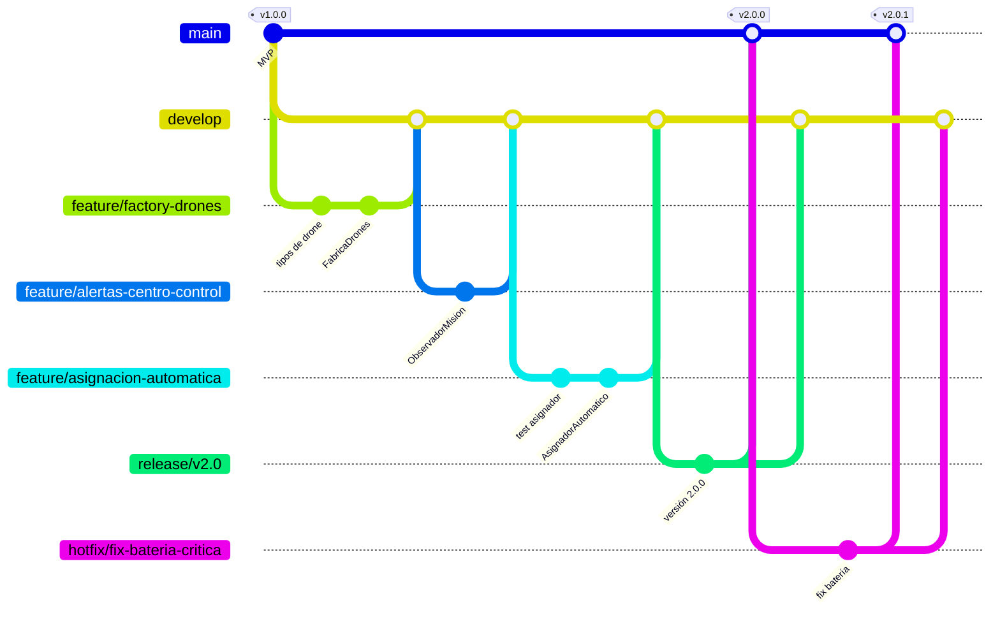

# AquaPort

Sistema de gestión de drones acuáticos de la Escuela Colombiana de Ingeniería. El mismo proyecto evoluciona en tres niveles: Piplup (MVP), Prinplup (v2) y Empoleon (Enterprise).

**Autor:** Juan Nicolás Álvarez Muñoz
**Curso:** DOSW 2026-2

## Nivel Piplup - MVP (v1.0.0)

| # | Reto | Entrega |
|---|---|---|
| 01 | Streams y lambdas | [docs/01-streams.md](docs/01-streams.md) |
| 02 | GitHub y GitFlow | [docs/02-gitflow.md](docs/02-gitflow.md) |
| 03 | Patrón Builder | [docs/03-builder.md](docs/03-builder.md) |
| 04 | SOLID (SRP y DIP) | [docs/04-solid.md](docs/04-solid.md) |
| 05 | Diagrama de contexto C4 | [docs/05-c4-contexto.md](docs/05-c4-contexto.md) |
| 06 | RF, RNF y MoSCoW | [docs/06-requisitos.md](docs/06-requisitos.md) |
| 07 | Plantilla DOSW | [docs/07-plantilla-dosw.md](docs/07-plantilla-dosw.md) |
| 08 | Manual de identidad y UX/UI | [docs/08-manual-identidad.md](docs/08-manual-identidad.md) |
| 09 | Agilismo y Jira | [docs/09-jira.md](docs/09-jira.md) |
| 10 | Diagrama de casos de uso | [docs/10-casos-de-uso.md](docs/10-casos-de-uso.md) |
| 11 | Mocks con IA | [docs/11-mocks-ia.md](docs/11-mocks-ia.md) |
| 12 | TDD | [docs/12-tdd.md](docs/12-tdd.md) |
| 13 | JaCoCo | [docs/13-jacoco.md](docs/13-jacoco.md) |
| 14 | SonarQube | [docs/14-sonarqube.md](docs/14-sonarqube.md) |

## Nivel Prinplup - v2 (v2.0.x)

| # | Reto | Entrega |
|---|---|---|
| 01 | Streams avanzados | [docs/prinplup/01-streams.md](docs/prinplup/01-streams.md) |
| 02 | GitFlow con release y hotfix | [Sección GitFlow v2](#gitflow-de-la-v2) |
| 03 | Strategy, Observer y Factory Method | [docs/prinplup/03-patrones.md](docs/prinplup/03-patrones.md) |
| 04 | SOLID completo | [Sección SOLID v2](#auditoría-solid-de-la-v2) |
| 05 | Contexto C4 v2 | [docs/prinplup/05-c4-contexto.md](docs/prinplup/05-c4-contexto.md) |
| 06 | RF, RNF y tensión AP-07/AP-08 | [docs/prinplup/06-requisitos.md](docs/prinplup/06-requisitos.md) |
| 07 | Plantilla DOSW AP-07 | [docs/prinplup/07-plantilla-dosw.md](docs/prinplup/07-plantilla-dosw.md) |
| 08 | Sistema de diseño y leyes UX | [docs/prinplup/08-identidad-ux.md](docs/prinplup/08-identidad-ux.md) |
| 09 | Sprint planning en Jira | [docs/prinplup/09-jira.md](docs/prinplup/09-jira.md) |
| 10 | Casos de uso v2 | [docs/prinplup/10-casos-de-uso.md](docs/prinplup/10-casos-de-uso.md) |
| 11 | Mocks del flujo de asignación | [docs/prinplup/11-mocks-ia.md](docs/prinplup/11-mocks-ia.md) |
| 12 | TDD con Mockito | [docs/prinplup/12-tdd.md](docs/prinplup/12-tdd.md) |
| 13 | Quality gate de JaCoCo | [docs/prinplup/13-jacoco.md](docs/prinplup/13-jacoco.md) |
| 14 | SonarQube v2 | [docs/prinplup/14-sonarqube.md](docs/prinplup/14-sonarqube.md) |

### GitFlow de la v2

| Rama | Propósito |
|---|---|
| `main` | Código en producción. `v1.0.0` es el MVP aprobado. |
| `develop` | Integración de las features de la v2. |
| `feature/factory-drones` | Jerarquía de drones y `FabricaDrones`. |
| `feature/alertas-centro-control` | Observadores del centro de control y del técnico. |
| `feature/asignacion-automatica` | `AsignadorAutomatico` con Strategy (TDD con Mockito). |
| `feature/streams-avanzados`, `feature/jacoco-quality-gate`, `feature/sonarqube-v2`, `feature/documentacion-v2`, `feature/ux-v2`, `feature/planeacion-jira-v2` | Resto de retos del nivel. |
| `release/v2.0` | Preparación de la versión: solo ajustes y corrección de errores. |
| `hotfix/fix-bateria-critica` | Corrección urgente sobre `main` después de publicar la v2. |

Cada feature sale de `develop` y vuelve por Pull Request. La rama `release/v2.0` sale de `develop`, recibe el ajuste de versión, se integra en `main` con el tag `v2.0.0` y se devuelve a `develop`. El hotfix sale de `main`, se integra en `main` con el tag `v2.0.1` y también se lleva a `develop`.



### Auditoría SOLID de la v2

| Clase o interfaz | Principio | Cómo lo aplica |
|---|---|---|
| `AsignadorAutomatico` | SRP, DIP | Solo coordina la asignación. Recibe por constructor `RepositorioDrones`, `ServicioCondicionesHidricas`, `EstrategiaSeleccion` y `RepositorioMisiones`, que son interfaces. |
| `EstrategiaSeleccion` y sus 3 implementaciones | OCP, ISP | Una nueva forma de elegir drone es una clase nueva; el asignador no cambia. La interfaz tiene un solo método. |
| `ObservadorMision`, `CentroControlObserver`, `TecnicoMantenimientoObserver` | OCP, SRP | Se agregan o quitan observadores sin tocar el asignador. Cada observador solo decide cómo reaccionar a los eventos. |
| `DroneAcuatico` y sus 3 tipos | LSP, OCP | Cada tipo define su capacidad y en qué agua opera. `ValidadorMision` y las estrategias funcionan con cualquier tipo sin preguntar cuál es. |
| `FabricaDrones` | SRP | Es el único lugar donde se decide qué subclase crear. |
| `ValidadorMision` | SRP, OCP | Solo contiene reglas de negocio. Usa `getCapacidadMaximaGramos()` y `puedeOperarEn()`, así que no cambia cuando aparece un tipo nuevo. |
| `RepositorioDrones`, `RepositorioMisiones`, `ServicioCondicionesHidricas` | ISP, DIP | Interfaces pequeñas con lo que necesita cada cliente; las implementaciones en memoria o simuladas se pueden cambiar por otras. |

**Dónde se respeta cada principio y por qué importa en AquaPort**

- **S - Responsabilidad única:** `AsignadorAutomatico` coordina, `ValidadorMision` aplica reglas, las estrategias eligen y los observadores reaccionan. Si cambia la regla de batería mínima, solo cambia el validador. En AquaPort las reglas de operación hídrica cambian con frecuencia, y así no se rompe la asignación.
- **O - Abierto/cerrado:** para agregar un cuarto tipo de drone (por ejemplo, Sumergible Profundo) se crea `DroneSumergibleProfundo`, se agrega el valor en `TipoDrone` y su caso en `FabricaDrones`. `AsignadorAutomatico` y `ValidadorMision` no se tocan. La flota va a crecer en el nivel Enterprise.
- **L - Sustitución de Liskov:** donde el sistema recibe un `DroneAcuatico` funciona con cualquiera de los tres tipos. Ninguno lanza excepciones ni retorna `null` donde el padre no lo hace. Lo verifica la prueba `TiposDroneTest.tiposIntercambiables_comoDroneAcuatico`. Así el asignador puede tratar la flota mixta como una sola lista.
- **I - Segregación de interfaces:** `EstrategiaSeleccion`, `RepositorioDrones` y `ServicioCondicionesHidricas` tienen un solo método. Las pruebas con Mockito simulan solo lo que necesitan y las implementaciones no cargan métodos que no usan.
- **D - Inversión de dependencias:** el asignador depende de abstracciones. En la v2 las condiciones del agua vienen de `CondicionesHidricasSimuladas`, pero se puede conectar la API hídrica real sin cambiar la lógica de asignación.

## Nivel Empoleon - Enterprise (v3.0.0)

| # | Reto | Entrega |
|---|---|---|
| 01 | Streams para rutas multi-etapa | [docs/empoleon/01-streams.md](docs/empoleon/01-streams.md) |
| 02 | Historial de git trazable | [docs/empoleon/02-git.md](docs/empoleon/02-git.md) |
| 03 | Chain of Responsibility, Decorator y Adapter | [docs/empoleon/03-patrones.md](docs/empoleon/03-patrones.md) |
| 04 | Auditoría SOLID | [docs/empoleon/04-solid.md](docs/empoleon/04-solid.md) |
| 05 | C4 nivel 2: contenedores | [docs/empoleon/05-c4-contenedores.md](docs/empoleon/05-c4-contenedores.md) |
| 06 | Requisitos Enterprise | [docs/empoleon/06-requisitos.md](docs/empoleon/06-requisitos.md) |
| 07 | Plantilla DOSW AP-15 | [docs/empoleon/07-plantilla-dosw.md](docs/empoleon/07-plantilla-dosw.md) |
| 08 | Design system y mapa de flujos | [docs/empoleon/08-design-system.md](docs/empoleon/08-design-system.md) |
| 09 | Roadmap en Jira | [docs/empoleon/09-jira.md](docs/empoleon/09-jira.md) |
| 10 | Casos de uso Enterprise | [docs/empoleon/10-casos-de-uso.md](docs/empoleon/10-casos-de-uso.md) |
| 11 | Mocks del flujo Enterprise | [docs/empoleon/11-mocks-ia.md](docs/empoleon/11-mocks-ia.md) |
| 12 | Pruebas en tres capas | [docs/empoleon/12-tdd.md](docs/empoleon/12-tdd.md) |
| 13 | JaCoCo + SonarQube Enterprise | [docs/empoleon/13-jacoco-sonarqube.md](docs/empoleon/13-jacoco-sonarqube.md) |
| 14 | Arquitectura por capas | [Sección de auditoría](#auditoría-de-la-arquitectura-por-capas) |

### Auditoría de la arquitectura por capas

**Regla de dependencias:** infraestructura puede depender de aplicación y dominio; aplicación solo de dominio; dominio no depende de nada externo.


**Herramientas usadas**

1. **ArchUnit** (`src/test/java/edu/eci/aquaport/ArquitecturaCapasTest.java`). Se ejecuta junto con las pruebas del proyecto:

   | Regla | Resultado |
   |---|---|
   | `capasRespetanDireccionDeDependencias`: infraestructura no es usada por ninguna capa, aplicación solo por infraestructura, dominio por aplicación e infraestructura | Cumple |
   | `dominioSoloUsaJavaEstandar`: el dominio solo depende de `java..` y de sí mismo | Cumple |
   | `dominioNoCreaInfraestructura`: ninguna clase del dominio llama constructores de infraestructura | Cumple |
   | `dependenciasDePuertosSonFinales`: los puertos que usan dominio y aplicación son campos `final` (inyección por constructor) | Cumple |

2. **Revisión manual con grep**:

   | Búsqueda | Resultado |
   |---|---|
   | Imports del dominio que no sean `java.*` ni del propio dominio | 0 |
   | Imports de `aplicacion` o `infraestructura` dentro del dominio | 0 |
   | Imports de `infraestructura` dentro de aplicación | 0 |
   | Imports externos (no `java.*`) en aplicación | 0 |
   | `new` de clases de infraestructura en dominio o aplicación | 0 |
   | `@Autowired`, `@Inject` o setters de dependencias | 0 |

   ```bash
   grep -rhE "^import " src/main/java/edu/eci/aquaport/dominio | grep -vE "^import (static )?(java\.|edu\.eci\.aquaport\.dominio\.)"
   grep -rlE "^import edu\.eci\.aquaport\.(aplicacion|infraestructura)" src/main/java/edu/eci/aquaport/dominio
   grep -rlE "^import edu\.eci\.aquaport\.infraestructura" src/main/java/edu/eci/aquaport/aplicacion
   ```

**Resultado:** 44 clases en dominio, 7 en aplicación y 14 en infraestructura, sin violaciones de capa. Las dependencias externas (Logger de notificación, cliente de la API hídrica, almacenamiento) viven en infraestructura y llegan a la aplicación por los puertos del dominio.

## Evaluación con IA

El reporte de evaluación hecho con la IA asistente (Gemini) está en [docs/evaluacion-ia/reporte-evaluacion-gemini.md](docs/evaluacion-ia/reporte-evaluacion-gemini.md).
