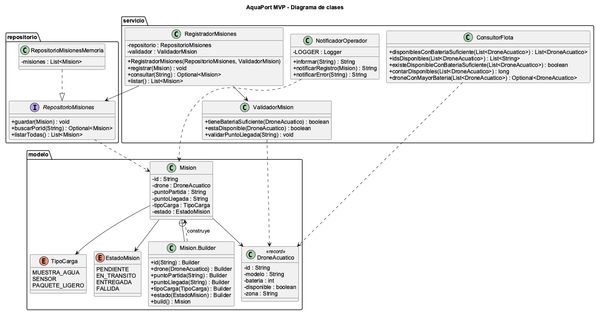

# Reto 04 - Principios SOLID (SRP y DIP)

## Problema de la clase GestorMision

La clase `GestorMision` del enunciado tiene cuatro responsabilidades: guardar misiones, enviar correos, calcular rutas e imprimir reportes. Esto significa que puede cambiar por cuatro motivos distintos, lo que incumple el Principio de Responsabilidad Única (SRP).

## Separación de responsabilidades

| Clase | Responsabilidad única | Motivo de cambio |
|---|---|---|
| `RegistradorMisiones` | Registrar misiones y consultarlas | Cambia la forma en que se registran o consultan las misiones |
| `ValidadorMision` | Aplicar las reglas de negocio (batería mínima, disponibilidad, zona válida) | Cambian las reglas de negocio |
| `NotificadorOperador` | Mostrar mensajes al operador | Cambia la forma de informar al operador |
| `RepositorioMisiones` | Definir cómo se almacenan las misiones | Cambia el mecanismo de almacenamiento |

## Aplicación de DIP

`RegistradorMisiones` no crea su almacenamiento. Recibe por constructor un objeto de tipo `RepositorioMisiones`, que es una interfaz. En el MVP se usa `RepositorioMisionesMemoria`, pero si más adelante se necesita una base de datos solo se crea otra implementación de la interfaz y no hay que modificar el registrador.

```java
RegistradorMisiones registrador = new RegistradorMisiones(new RepositorioMisionesMemoria(), new ValidadorMision());
```

## Diagrama de clases


