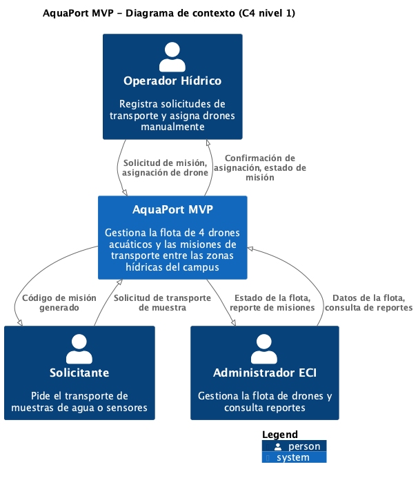

# Reto 05 - Diagrama de contexto C4

El diagrama muestra AquaPort MVP como una caja negra y las personas que interactúan con él. No incluye clases ni componentes internos. En el MVP no hay sistemas externos, por eso solo aparecen los tres actores y el sistema.

| Origen | Destino | Información que fluye |
|---|---|---|
| Operador Hídrico | AquaPort MVP | Solicitud de misión, asignación de drone |
| AquaPort MVP | Operador Hídrico | Confirmación de asignación, estado de misión |
| Solicitante | AquaPort MVP | Solicitud de transporte de muestra |
| AquaPort MVP | Solicitante | Código de misión generado |
| Administrador ECI | AquaPort MVP | Datos de la flota, consulta de reportes |
| AquaPort MVP | Administrador ECI | Estado de la flota, reporte de misiones |

Fuente del diagrama: [diagramas/c4-contexto-piplup.puml](diagramas/c4-contexto-piplup.puml)
