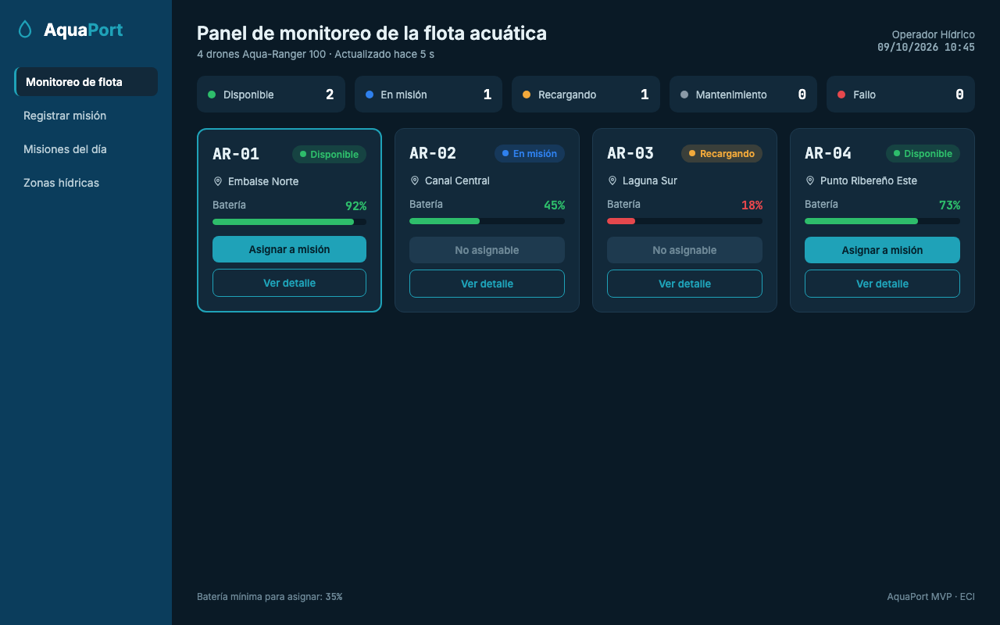

# Reto 08 - Manual de identidad y UX/UI

## Concepto

AquaPort es un sistema de monitoreo hídrico. La identidad busca transmitir calma, precisión y relación con el entorno natural, por eso se basa en azules profundos y cianes, sobre un fondo oscuro que reduce el cansancio visual en pantallas de monitoreo que permanecen encendidas durante toda la jornada.

## Paleta principal

| Uso | Nombre | Hex | Justificación |
|---|---|---|---|
| Primario | Azul Embalse | `#0B3D5C` | Representa el agua profunda de los embalses y da sensación de estabilidad. Se usa en la navegación. |
| Secundario | Cian Técnico | `#1FA2B8` | Color de acción. Se usa en botones, enlaces y elementos seleccionados para que destaquen sobre el fondo. |
| Fondo | Noche Hídrica | `#0A1A26` | Fondo oscuro tipo panel técnico. |
| Superficie | Azul Panel | `#12293A` | Tarjetas y bloques de información. |
| Borde | Azul Borde | `#1E3A4F` | Separación entre elementos. |
| Texto principal | Blanco Espuma | `#E6F1F5` | Alto contraste sobre el fondo. |
| Texto secundario | Gris Niebla | `#8FA9B6` | Etiquetas y datos de apoyo. |

## Colores de estado

| Estado del drone | Hex | Muestra |
|---|---|---|
| Disponible | `#2EBD6B` | Verde |
| En misión | `#2F80ED` | Azul |
| Recargando | `#F2A93B` | Ámbar |
| Mantenimiento | `#8A99A6` | Gris |
| Fallo | `#E5484D` | Rojo |

El estado siempre se muestra con color **y** con texto, para que no dependa solo del color.

La barra de batería usa verde desde 40%, ámbar entre 35% y 39% y rojo por debajo de 35%, que es el mínimo para asignar un drone.

## Tipografía

| Uso | Fuente | Motivo |
|---|---|---|
| Interfaz | Inter (sans-serif) | Muy legible en pantalla y en tamaños pequeños. |
| IDs y códigos | JetBrains Mono (monoespaciada) | Los IDs como `AR-01` o `M-014` y los porcentajes se alinean y se distinguen del texto normal. |

Tamaños: título 24 px, ID de drone 20 px, texto 14 px, etiquetas 12-13 px.

## Tono de voz

Técnico, preciso y directo. Los mensajes indican qué pasó, con qué drone y qué hacer.

- Correcto: "El drone AR-03 tiene batería insuficiente (18%). Mínimo requerido: 35%."
- Incorrecto: "Error de asignación".

## Mock del panel de monitoreo de la flota

Generado con IA a partir de esta identidad (el proceso y el prompt están en el [reto 11](11-mocks-ia.md)).

## Heurísticas de Nielsen que cumple el mock

| # | Heurística | Cómo se cumple |
|---|---|---|
| 1 | Visibilidad del estado del sistema | Cada tarjeta muestra el estado del drone con color y texto, la batería con número y barra, y el encabezado indica hace cuánto se actualizó la información. El resumen superior cuenta los drones por estado. |
| 2 | Relación con el mundo real | Usa los nombres reales de las zonas del campus (Embalse Norte, Laguna Sur, etc.) y los términos del operador: misión, batería, zona. |
| 4 | Consistencia y estándares | Todas las tarjetas tienen la misma estructura y los colores de estado son los mismos en el resumen y en las tarjetas. |
| 5 | Prevención de errores | El botón "Asignar a misión" aparece deshabilitado en los drones que no están disponibles o que tienen batería menor a 35%, en lugar de mostrar un error después. |
| 6 | Reconocer antes que recordar | El mínimo de batería (35%) se muestra en el pie del panel y el operador no tiene que memorizarlo. |
| 8 | Diseño estético y minimalista | Cada tarjeta muestra solo ID, estado, zona y batería, que es lo necesario para decidir. |
| 9 | Ayudar a reconocer y corregir errores | El mensaje de fallo explica qué ocurrió, cuándo y qué hacer: "Fallo de propulsión detectado a las 10:42. Revise el drone antes de asignarlo." |
