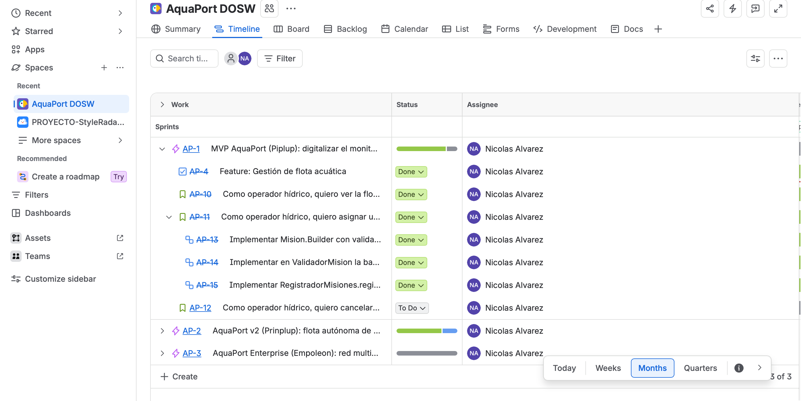

# Reto 09 - Agilismo y Jira

Proyecto en Jira: **AquaPort DOSW** (clave `AP`) · [tablero](https://mail-team-nyjtgqcj.atlassian.net/jira/software/projects/AP/boards/72/backlog)

## Jerarquía

El proyecto es gestionado por el equipo y Jira solo permite tres niveles (Épica → Historia/Tarea → Subtarea). Por eso la Feature se registró como una tarea con la etiqueta `feature` dentro de la épica, y cada historia se enlazó a ella con la relación *relates to* y con la etiqueta `feature-gestion-flota`.

| Nivel | Ticket | Contenido |
|---|---|---|
| Épica | [AP-1](https://mail-team-nyjtgqcj.atlassian.net/browse/AP-1) | MVP AquaPort (Piplup): digitalizar el monitoreo y reparto hídrico de la ECI con una flota de drones acuáticos supervisada |
| Feature | [AP-4](https://mail-team-nyjtgqcj.atlassian.net/browse/AP-4) | Gestión de flota acuática |
| Historia | [AP-10](https://mail-team-nyjtgqcj.atlassian.net/browse/AP-10) | Como operador hídrico, quiero ver la flota con el estado, la batería y la zona de cada drone, para saber cuáles puedo usar antes de registrar una misión. |
| Historia | [AP-11](https://mail-team-nyjtgqcj.atlassian.net/browse/AP-11) | Como operador hídrico, quiero asignar un drone disponible a una misión de transporte, para que la muestra o el sensor llegue a la zona de destino. |
| Historia | [AP-12](https://mail-team-nyjtgqcj.atlassian.net/browse/AP-12) | Como operador hídrico, quiero cancelar una misión que está en estado PENDIENTE, para corregir una asignación equivocada antes de que el drone salga. |

## Subtareas de AP-11 (asignar drone a misión)

| Ticket | Subtarea |
|---|---|
| [AP-13](https://mail-team-nyjtgqcj.atlassian.net/browse/AP-13) | Implementar `Mision.Builder` con validación de campos obligatorios y disponibilidad del drone en `build()`. |
| [AP-14](https://mail-team-nyjtgqcj.atlassian.net/browse/AP-14) | Implementar en `ValidadorMision` la batería mínima de 35% y la zona de destino válida con pruebas JUnit 5 (TDD). |
| [AP-15](https://mail-team-nyjtgqcj.atlassian.net/browse/AP-15) | Implementar `RegistradorMisiones.registrar` que guarde en `RepositorioMisiones` y muestre el error de batería insuficiente. |

## Criterios de aceptación de AP-11

1. **Dado** un drone disponible con batería mayor o igual a 35% y una zona de destino válida, **cuando** el operador lo asigna a una misión, **entonces** la misión queda registrada en estado PENDIENTE con un código generado.
2. **Dado** un drone con batería menor a 35%, **cuando** el operador intenta asignarlo, **entonces** el sistema no registra la misión y muestra el mensaje "El drone AR-XX tiene batería insuficiente (N%). Mínimo requerido: 35%."

## Sprint 1 · MVP Piplup

- **Objetivo:** entregar el MVP de AquaPort: consultar la flota y registrar misiones con asignación manual validada.
- **Fechas:** 14 al 25 de septiembre de 2026 (cerrado).
- **Resultado:** AP-4, AP-10, AP-11 y sus subtareas quedaron finalizadas. AP-12 (cancelar misión) volvió al backlog.

## Captura

