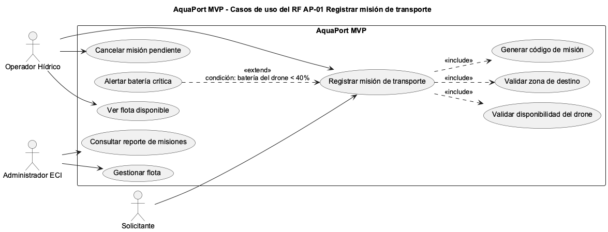

# Reto 10 - Diagrama de casos de uso

Diagrama del RF AP-01 "Registrar misión de transporte".

## Relaciones

| Relación | Tipo | Explicación |
|---|---|---|
| Registrar misión → Validar disponibilidad del drone | `<<include>>` | Siempre se ejecuta. Sin esta validación no se puede registrar la misión. |
| Registrar misión → Validar zona de destino | `<<include>>` | Siempre se revisa que el punto de llegada sea una zona del campus. |
| Registrar misión → Generar código de misión | `<<include>>` | Toda misión registrada recibe un código. |
| Alertar batería crítica → Registrar misión | `<<extend>>` | Solo ocurre si la batería del drone asignado es menor a 40%. El registro funciona sin esta alerta. |

## Actores

- **Operador Hídrico:** registra misiones, ve la flota y cancela misiones pendientes.
- **Solicitante:** participa en el registro porque es quien pide el transporte y recibe el código de misión.
- **Administrador ECI:** gestiona la flota y consulta el reporte de misiones.
