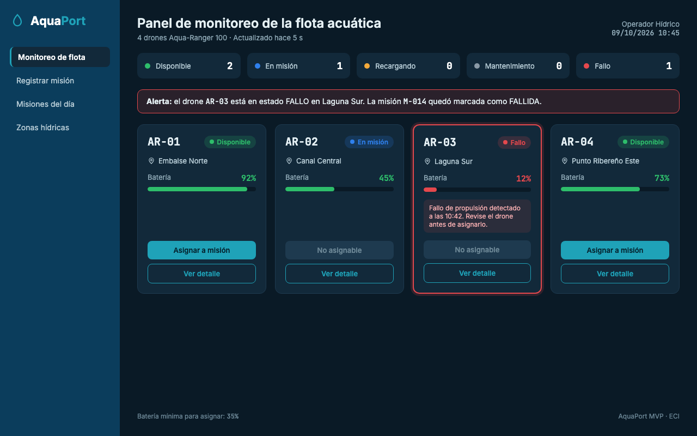
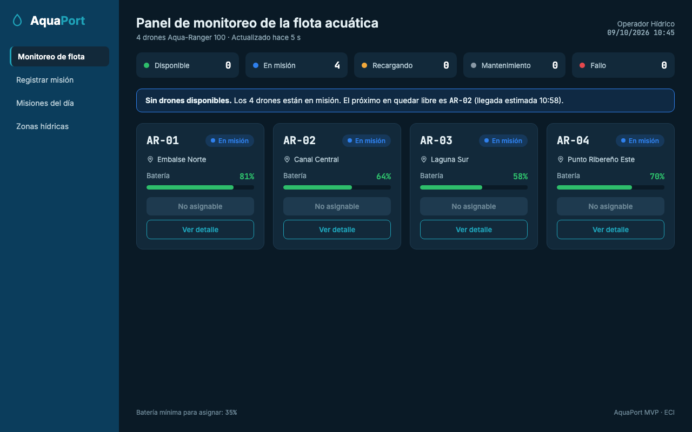

# Reto 11 - Mocks con IA

## 1. Referencias

Se revisaron paneles de monitoreo de vehículos acuáticos y de calidad del agua para tomar ideas de organización:

- **Saildrone Mission Portal:** panel de seguimiento de drones de superficie, muestra cada vehículo con su estado y posición.
- **Sofar Ocean Spotter Dashboard:** panel de boyas de monitoreo con indicadores de batería y última actualización.

De ambos se tomó la idea de mostrar cada vehículo como una tarjeta con estado, batería y ubicación, y un resumen general en la parte superior.

## 2. Estilo

Se usó la identidad definida en el [reto 08](08-manual-identidad.md): Azul Embalse `#0B3D5C`, Cian Técnico `#1FA2B8`, fondo `#0A1A26`, tipografía Inter y JetBrains Mono, y los colores de estado.

## 3. Datos del RF AP-01

Para que el operador pueda registrar una misión necesita ver de cada drone: ID, batería, estado y zona actual. Las acciones disponibles son seleccionar drone, asignar a misión y ver detalle.

## 4. Prompt utilizado

```
Actúa como diseñador UX/UI senior de sistemas de monitoreo ambiental.

SISTEMA: AquaPort — Panel de control de flota de drones acuáticos ECI
PANTALLA: Panel de monitoreo de la flota (vista principal del operador)
ESTILO: Color primario Azul Embalse #0B3D5C, color de acción Cian Técnico #1FA2B8,
  fondo #0A1A26, tarjetas #12293A, texto #E6F1F5. Tipografía Inter para la interfaz
  y JetBrains Mono para IDs, códigos y porcentajes. Fondo oscuro tipo dashboard técnico hídrico.
  Colores de estado: DISPONIBLE #2EBD6B, EN_MISION #2F80ED, RECARGANDO #F2A93B,
  MANTENIMIENTO #8A99A6, FALLO #E5484D. El estado se muestra con color y texto.
ACTOR: Operador Hídrico — necesita tomar decisiones rápidas sobre la flota
DATOS A MOSTRAR POR DRONE: ID (formato AR-XX), batería en %, estado
  (DISPONIBLE/EN_MISION/RECARGANDO/MANTENIMIENTO/FALLO), zona actual
  Flota: AR-01, AR-02, AR-03 y AR-04, modelo Aqua-Ranger 100.
  Zonas: Embalse Norte, Canal Central, Laguna Sur, Punto Ribereño Este, Laboratorio Hídrico.
ACCIONES DEL OPERADOR: Seleccionar drone, Asignar a misión, Ver detalle
  El botón "Asignar a misión" debe aparecer deshabilitado si el drone no está
  disponible o tiene batería menor a 35%.
ESTADOS DE LA PANTALLA:
  1. Normal: flota con drones en distintos estados
  2. Alerta: un drone en estado FALLO (destacado visualmente)
  3. Vacío: todos los drones en misión simultáneamente
Nielsen: visibilidad del estado (#1), minimalismo (#8), prevención errores (#5)
```

## 5. Resultados

### Estado normal


### Estado de alerta



### Estado vacío



## Heurísticas de Nielsen

| Heurística | Normal | Alerta | Vacío |
|---|---|---|---|
| #1 Visibilidad del estado | Estado y batería de cada drone visibles sin clics; resumen por estado arriba. | El drone en fallo tiene borde rojo y aparece un aviso en la parte superior. | El aviso indica que no hay drones libres y cuál se libera primero. |
| #5 Prevención de errores | "Asignar a misión" deshabilitado en AR-02 (en misión) y AR-03 (recargando, 18%). | No se puede asignar AR-03 mientras esté en fallo. | Todos los botones de asignar están deshabilitados. |
| #8 Diseño minimalista | Solo ID, estado, zona y batería. | Solo se agrega el mensaje del fallo en la tarjeta afectada. | No se agregan elementos extra. |
| #9 Mensajes de error claros | — | "Fallo de propulsión detectado a las 10:42. Revise el drone antes de asignarlo." | — |

Las tres pantallas usan la misma paleta, tipografía y estructura, por lo que son coherentes entre sí.
