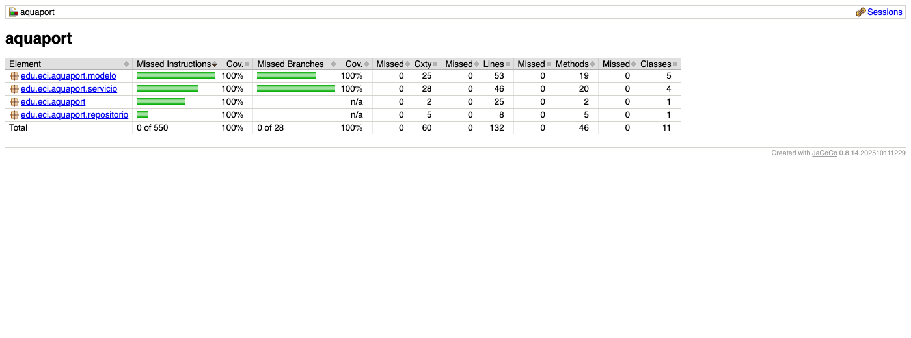
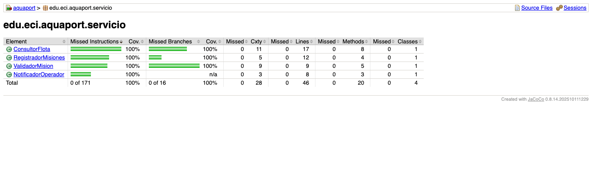

# Reto 13 - Cobertura con JaCoCo

## Ejecución

```bash
mvn clean test
```

El reporte se genera en `target/site/jacoco/index.html`.

## Resultado

| Clase | Cobertura de líneas | Cobertura de ramas |
|---|---|---|
| ValidadorMision | 100% | 100% |
| RegistradorMisiones | 100% | 100% |
| ConsultorFlota | 100% | 100% |
| NotificadorOperador | 100% | n/a |
| Mision y Mision.Builder | 100% | 100% |

El `ValidadorMision` supera el mínimo de 80% exigido y no quedan líneas en rojo ni ramas en amarillo en ninguna clase del proyecto. Para lograrlo se agregaron pruebas de los casos que faltaban: drone disponible con batería baja en `ConsultorFlota`, cada campo obligatorio del Builder y el caso en que `Main` intenta registrar una misión con un drone no disponible.

## Capturas

Reporte general:



Paquete de servicios (incluye `ValidadorMision`):


