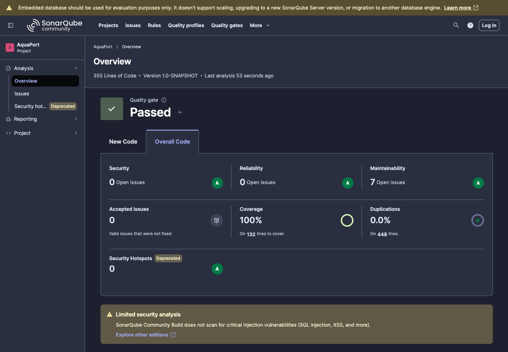
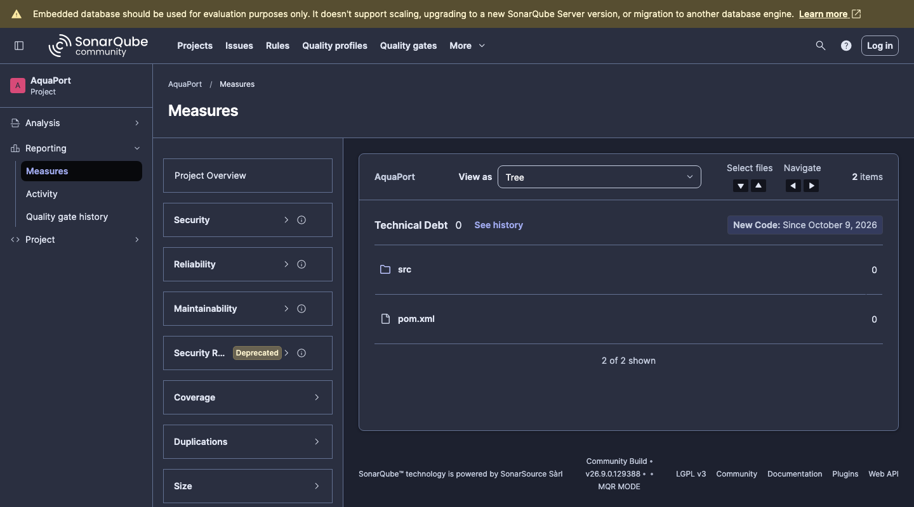

# Reto 14 - Análisis estático con SonarQube

## Ejecución

Se usó SonarQube Community en Docker:

```bash
docker run -d --name sonarqube -p 9000:9000 sonarqube:community
mvn clean verify sonar:sonar -Dsonar.token=<token>
```

La configuración del proyecto (clave, URL y reporte de JaCoCo) está en las propiedades del `pom.xml`.

## Resultado del primer análisis

| Tipo | Cantidad |
|---|---|
| Bugs | 0 |
| Vulnerabilidades | 0 |
| Code smells | 7 |
| Deuda técnica | 70 min |



## Code smells corregidos

| Regla | Qué era | Por qué era un problema | Cómo se corrigió | Commit |
|---|---|---|---|---|
| java:S1192 | El texto `"Aqua-Ranger 100"` se repetía 4 veces en `Main`. | Si cambia el modelo hay que editar varios lugares y es fácil dejar uno sin actualizar. | Se creó la constante `MODELO`. | `refactor: reemplazar literal duplicado del modelo por constante en Main` |
| java:S106 (6 casos) | `Main` mostraba los resultados con `System.out.println`. | La salida estándar no permite configurar niveles ni destino de los mensajes. | `NotificadorOperador` usa `java.util.logging.Logger` y `Main` le delega todos los mensajes. | `refactor: reemplazar System.out por Logger en NotificadorOperador y Main` |

No se usó `@SuppressWarnings` en ningún caso.

## Resultado final

| Tipo | Cantidad |
|---|---|
| Bugs | 0 |
| Vulnerabilidades | 0 |
| Code smells | 0 |
| Deuda técnica | 0 |
| Cobertura | 100% |
| Duplicación | 0% |



