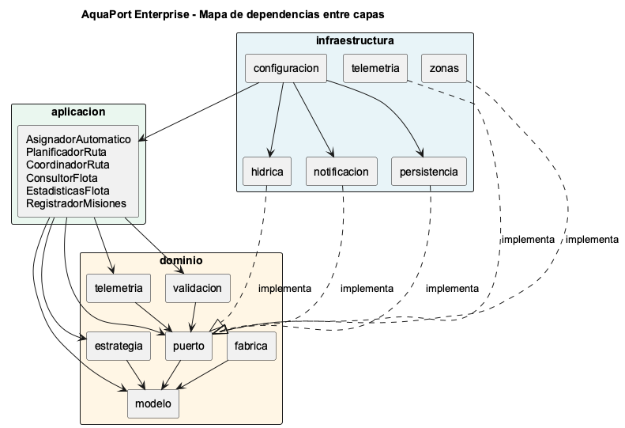

# Empoleon · Reto 04 - Auditoría SOLID de la arquitectura Enterprise

## Mapa de dependencias entre capas

| Capa | Paquetes | Puede depender de |
|---|---|---|
| Dominio | `modelo`, `puerto`, `estrategia`, `validacion`, `telemetria`, `fabrica` | Solo Java estándar y el mismo dominio |
| Aplicación | `aplicacion` | Dominio |
| Infraestructura | `configuracion`, `persistencia`, `hidrica`, `notificacion`, `telemetria`, `zonas` | Aplicación y dominio |

## Verificaciones

| Verificación | Herramienta | Resultado |
|---|---|---|
| Ninguna clase del dominio depende de infraestructura ni de aplicación | ArchUnit (`capasRespetanDireccionDeDependencias`) y `grep` de imports | Sin violaciones |
| El dominio solo importa `java.*` | ArchUnit (`dominioSoloUsaJavaEstandar`) y `grep` | Sin imports externos |
| No hay `new ClaseInfraestructura()` en el dominio | ArchUnit (`dominioNoCreaInfraestructura`) y `grep` | Ninguno |
| Los servicios reciben sus dependencias por constructor | ArchUnit (`dependenciasDePuertosSonFinales`): todo campo cuyo tipo es un puerto del dominio es `final`, por lo que solo se asigna en el constructor | Cumple |
| No hay inyección por campo ni por setter | `grep` de `@Autowired`, `@Inject` y `set...` | Ninguno |
| Issues de SonarQube | Perfil y quality gate Enterprise | 0 issues |

`AsignadorAutomatico.cambiarEstrategia` no es inyección de dependencias: es la forma en que el patrón Strategy permite cambiar el comportamiento en tiempo de ejecución. La estrategia inicial también llega por constructor.

## Principios en el código Enterprise

| Principio | Dónde | Por qué importa en AquaPort |
|---|---|---|
| **S** | `PlanificadorRuta` arma la ruta, `CoordinadorRuta` la ejecuta, cada validador revisa una sola regla, `AdaptadorAPIHidrica` solo traduce la API. | Una falla en la ejecución de rutas no obliga a tocar la planificación, y viceversa. |
| **O** | Nuevos eslabones de validación, nuevos decorators, nuevas estrategias u observadores se agregan sin modificar las clases existentes. | Las reglas de operación de cada embalse cambian; se agregan sin riesgo para las demás. |
| **L** | `DroneConMonitoreo` se usa en cualquier lugar donde se espera un `DroneAcuatico` y se comporta igual (prueba `comportamientoIgualAlOriginal`). | El coordinador no sabe si el drone está monitoreado. |
| **I** | Puertos pequeños: `MonitorZonas` y `RegistroTelemetria` tienen un método; `ObservadorRuta` está separado de `ObservadorMision`. | El técnico no necesita implementar eventos de rutas que no le interesan. |
| **D** | Aplicación depende de puertos (`RepositorioDrones`, `ServicioCondicionesHidricas`, `MonitorZonas`, `RegistroTelemetria`) que la infraestructura implementa. | Se puede cambiar la API simulada por la real, o la memoria por PostgreSQL, sin tocar los casos de uso. |
