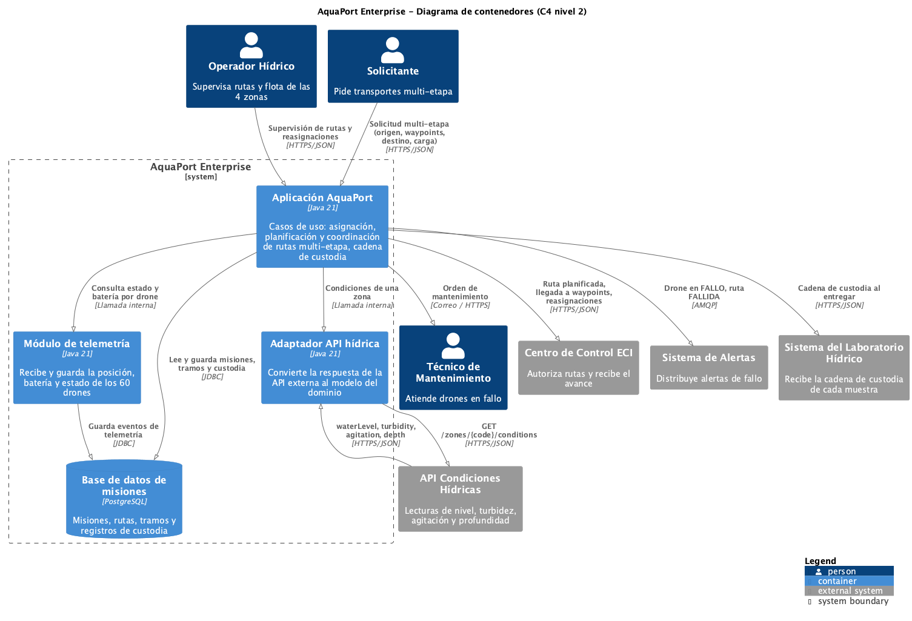

# Empoleon · Reto 05 - Diagrama de contenedores (C4 nivel 2)

| Origen | Destino | Protocolo | Dato |
|---|---|---|---|
| Solicitante | Aplicación AquaPort | HTTPS/JSON | Solicitud multi-etapa (origen, waypoints, destino, carga) |
| Operador Hídrico | Aplicación AquaPort | HTTPS/JSON | Supervisión de rutas y reasignaciones |
| Aplicación AquaPort | Base de datos de misiones | JDBC | Misiones, tramos y registros de custodia |
| Aplicación AquaPort | Módulo de telemetría | Llamada interna | Estado y batería por drone |
| Módulo de telemetría | Base de datos de misiones | JDBC | Eventos de telemetría |
| Aplicación AquaPort | Adaptador API hídrica | Llamada interna | Condiciones de una zona |
| Adaptador API hídrica | API Condiciones Hídricas | HTTPS/JSON | `GET /zones/{code}/conditions` y respuesta con `waterLevel`, `turbidity`, `agitation`, `depth` |
| Aplicación AquaPort | Centro de Control ECI | HTTPS/JSON | Ruta planificada, llegada a waypoints, reasignaciones |
| Aplicación AquaPort | Sistema de Alertas | AMQP | Drone en FALLO, ruta FALLIDA |
| Aplicación AquaPort | Sistema del Laboratorio Hídrico | HTTPS/JSON | Cadena de custodia al entregar |
| Aplicación AquaPort | Técnico de Mantenimiento | Correo / HTTPS | Orden de mantenimiento |

Relación con el código:

- **Aplicación AquaPort:** paquetes `aplicacion` y `dominio`.
- **Módulo de telemetría:** puerto `RegistroTelemetria` y su implementación en `infraestructura.telemetria`.
- **Adaptador API hídrica:** `infraestructura.hidrica`.
- **Base de datos:** el puerto `RepositorioMisiones`. Hoy se implementa en memoria y en producción se implementa con PostgreSQL sin cambiar los casos de uso.
