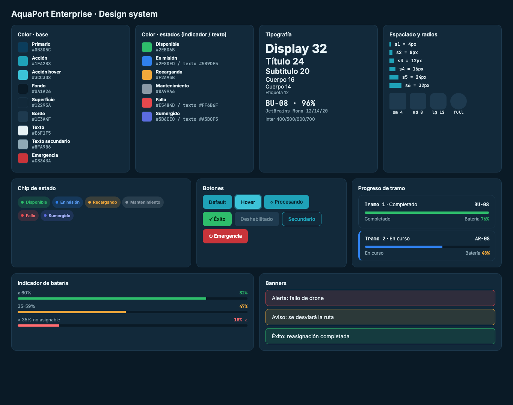
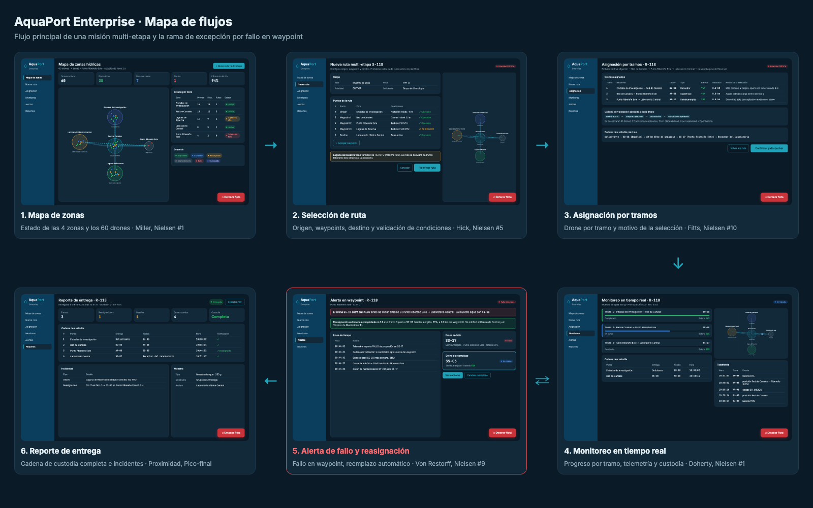

# Empoleon · Reto 08 - Design system y mapa de flujos Enterprise

## Tokens de diseño

### Color

| Token | Valor | Uso |
|---|---|---|
| `--primario` | `#0B3D5C` | Navegación |
| `--accion` | `#1FA2B8` | Botones principales y enlaces |
| `--accion-hover` | `#3CC3D8` | Hover del botón principal |
| `--fondo` | `#0A1A26` | Fondo de la aplicación |
| `--superficie` | `#12293A` | Tarjetas y paneles |
| `--borde` | `#1E3A4F` | Separadores |
| `--texto` | `#E6F1F5` | Texto principal |
| `--texto-2` | `#8FA9B6` | Texto secundario |
| `--texto-off` | `#6C8796` | Controles deshabilitados |
| `--emergencia` | `#C8343A` | Botón "Detener flota" |

### Colores de estado

Cada estado tiene un color de **indicador** (punto, borde, barra) y un color de **texto**. Se separaron porque algunos indicadores no alcanzan el contraste de texto exigido.

| Estado | Indicador | Texto |
|---|---|---|
| Disponible | `#2EBD6B` | `#2EBD6B` |
| En misión | `#2F80ED` | `#5B9DF5` |
| Recargando | `#F2A93B` | `#F2A93B` |
| Mantenimiento | `#8A99A6` | `#8A99A6` |
| Fallo | `#E5484D` | `#FF6B6F` |
| Sumergido | `#5B6CE0` | `#A5B0F5` |

### Tipografía

| Token | Fuente | Tamaño / peso |
|---|---|---|
| Display | Inter | 32 / 700 |
| Título | Inter | 24 / 600 |
| Subtítulo | Inter | 20 / 600 |
| Cuerpo | Inter | 16 y 14 / 400 |
| Etiqueta | Inter | 12 / 500 |
| Datos (IDs, porcentajes, horas) | JetBrains Mono | 12, 14 y 20 / 500-700 |

### Espaciado y radio de borde

| Token | Valor |
|---|---|
| `--s1` … `--s6` | 4, 8, 12, 16, 24, 32 px (escala de 4) |
| `--r-sm` | 4 px (etiquetas pequeñas) |
| `--r-md` | 8 px (botones, banners) |
| `--r-lg` | 12 px (tarjetas, paneles) |
| `--r-full` | 999 px (chips de estado) |

## Componentes y estados

| Componente | Estados |
|---|---|
| Chip de estado del drone | Disponible, En misión, Recargando, Mantenimiento, Fallo, Sumergido |
| Botón | Default, Hover, Procesando, Éxito, Deshabilitado, Secundario, Emergencia |
| Indicador de batería | ≥ 60% verde, 35–59% ámbar, < 35% rojo con advertencia y "no asignable" |
| Progreso de tramo | Completado (verde), En curso (azul), Pendiente (gris) |
| Banner | Alerta (rojo), Aviso (ámbar), Éxito (verde) |
| Tarjeta de drone | Heredada del nivel Prinplup ([ver componente](../mocks/prinplup/componente-tarjeta-drone.png)) |

## Verificación de contraste WCAG AA

Los valores se calcularon con la fórmula de luminancia relativa de WCAG 2.1. Se exige 4.5:1 para texto normal y 3:1 para indicadores gráficos.

| Estado | Indicador sobre superficie | Mín. 3:1 | Texto sobre superficie | Texto sobre fondo | Mín. 4.5:1 |
|---|---|---|---|---|---|
| Disponible | 6.13 | ✓ | 6.13 | 7.24 | ✓ |
| En misión | 3.87 | ✓ | 5.40 | 6.38 | ✓ |
| Recargando | 7.49 | ✓ | 7.49 | 8.85 | ✓ |
| Mantenimiento | 5.12 | ✓ | 5.12 | 6.05 | ✓ |
| Fallo | 3.82 | ✓ | 5.40 | 6.38 | ✓ |
| Sumergido | 3.32 | ✓ | 7.21 | 8.52 | ✓ |

| Otros pares | Contraste |
|---|---|
| Texto principal sobre superficie | 13.01 |
| Texto secundario sobre superficie | 6.07 |
| Texto `#04202B` sobre botón de acción | 5.55 |
| Texto blanco sobre botón de emergencia `#C8343A` | 5.24 |

**Ajustes hechos por la verificación:**

- En misión y Fallo usaban el mismo color para indicador y texto. Como texto daban 3.87 y 3.82 (no cumplen), así que se agregaron las variantes de texto `#5B9DF5` y `#FF6B6F`.
- Sumergido usaba `#1B4F9C` en la v2. No llegaba ni a 3:1 (1.88), así que se cambió a `#5B6CE0` para el indicador y `#A5B0F5` para el texto.
- El botón de emergencia pasó de `#E5484D` a `#C8343A`, porque el texto blanco solo alcanzaba 3.91.

Además, el estado nunca se comunica solo con color: siempre va acompañado del texto del estado.

## Mapa de flujos (6 pantallas)

| # | Pantalla | Leyes UX aplicadas |
|---|---|---|
| 1 | [Mapa de zonas](../mocks/empoleon/e1-mapa-zonas.png) | **Miller:** 5 indicadores arriba y 5 zonas en la tabla, agrupados para leerlos de un vistazo. **Región común:** los drones aparecen dentro del círculo de su zona. |
| 2 | [Selección de ruta](../mocks/empoleon/e2-configurar-ruta.png) | **Hick:** los puntos se agregan uno a uno sobre una lista corta de zonas; la carga se define antes para reducir opciones. **Prevención de errores:** el waypoint adverso se marca antes de planificar. |
| 3 | [Asignación por tramos](../mocks/empoleon/e3-asignacion-tramos.png) | **Fitts:** "Confirmar y despachar" es el botón más grande, abajo a la derecha, al final de la lectura. **Carga cognitiva:** cada tramo explica en una línea por qué se eligió el drone. |
| 4 | [Monitoreo en tiempo real](../mocks/empoleon/e4-monitoreo.png) | **Doherty:** telemetría actualizada cada pocos segundos para que el operador perciba respuesta inmediata. **Ley de Prägnanz:** el progreso de cada tramo es una barra simple. |
| 5 | [Alerta de fallo y reasignación](../mocks/empoleon/e5-alerta-reasignacion.png) | **Von Restorff:** la alerta es lo único rojo de la pantalla. **Fitts:** "Detener flota" fijo, grande y en la esquina. |
| 6 | [Reporte de entrega](../mocks/empoleon/e6-reporte-custodia.png) | **Proximidad:** incidentes y datos de la muestra agrupados por separado de la cadena de custodia. **Pico-final:** el cierre muestra claramente "Entregada" y "Custodia completa". |
