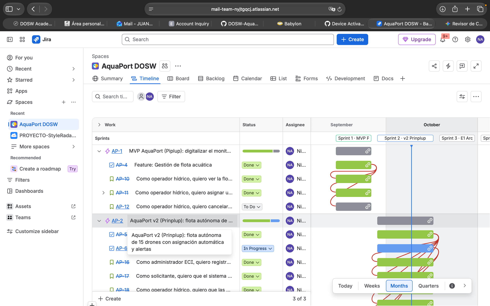
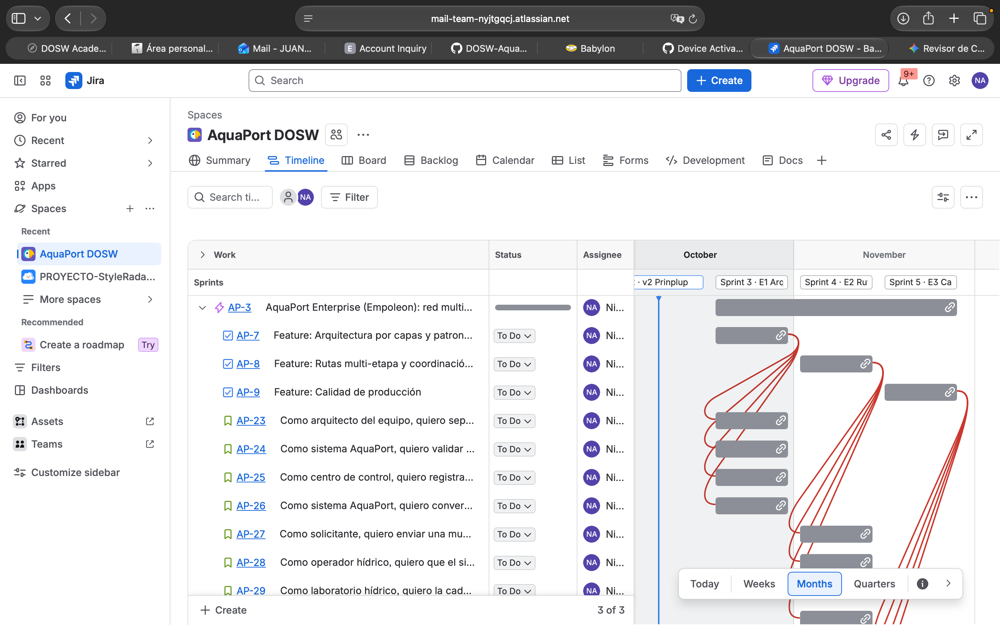

# Empoleon · Reto 09 - Roadmap Enterprise en Jira

Proyecto: **AquaPort DOSW** (`AP`) · Épica multi-sprint [AP-3](https://mail-team-nyjtgqcj.atlassian.net/browse/AP-3) (19 de octubre al 27 de noviembre de 2026)

## Roadmap

| Épica | Inicio | Fin | Estado |
|---|---|---|---|
| [AP-1](https://mail-team-nyjtgqcj.atlassian.net/browse/AP-1) MVP AquaPort (Piplup) | 14/09/2026 | 25/09/2026 | Sprint cerrado |
| [AP-2](https://mail-team-nyjtgqcj.atlassian.net/browse/AP-2) AquaPort v2 (Prinplup) | 28/09/2026 | 16/10/2026 | Sprint activo |
| [AP-3](https://mail-team-nyjtgqcj.atlassian.net/browse/AP-3) AquaPort Enterprise (Empoleon) | 19/10/2026 | 27/11/2026 | 3 sprints planificados |

## Sprints del Enterprise

### Sprint 3 · E1 Arquitectura (19 al 30 de octubre)

- **Goal:** separar AquaPort en capas y aplicar Chain of Responsibility, Decorator y Adapter.
- **Capacidad:** 21 SP · **Comprometido:** 21 SP · Feature [AP-7](https://mail-team-nyjtgqcj.atlassian.net/browse/AP-7)

| Ticket | Historia | SP |
|---|---|---|
| [AP-23](https://mail-team-nyjtgqcj.atlassian.net/browse/AP-23) | Separar el código en dominio, aplicación e infraestructura | 8 |
| [AP-24](https://mail-team-nyjtgqcj.atlassian.net/browse/AP-24) | Validar cada misión con una cadena de validadores | 5 |
| [AP-25](https://mail-team-nyjtgqcj.atlassian.net/browse/AP-25) | Registrar la telemetría de cada drone en misión | 3 |
| [AP-26](https://mail-team-nyjtgqcj.atlassian.net/browse/AP-26) | Convertir la respuesta de la API hídrica al modelo del dominio | 5 |

### Sprint 4 · E2 Rutas (2 al 13 de noviembre)

- **Goal:** planificar y ejecutar rutas multi-etapa con waypoints, reasignación ante fallos y cadena de custodia.
- **Capacidad:** 21 SP · **Comprometido:** 21 SP · Feature [AP-8](https://mail-team-nyjtgqcj.atlassian.net/browse/AP-8)

| Ticket | Historia | SP |
|---|---|---|
| [AP-27](https://mail-team-nyjtgqcj.atlassian.net/browse/AP-27) | Enviar una muestra por una ruta con waypoints intermedios | 8 |
| [AP-28](https://mail-team-nyjtgqcj.atlassian.net/browse/AP-28) | Reasignar automáticamente un tramo por fallo o batería crítica | 5 |
| [AP-29](https://mail-team-nyjtgqcj.atlassian.net/browse/AP-29) | Cadena de custodia completa de cada muestra | 5 |
| [AP-30](https://mail-team-nyjtgqcj.atlassian.net/browse/AP-30) | Reportes de eficiencia por zona y del mejor drone | 3 |

### Sprint 5 · E3 Calidad (16 al 27 de noviembre)

- **Goal:** alcanzar JaCoCo 85% en líneas y 75% en ramas, y SonarQube con 0 deuda sobre la arquitectura Enterprise.
- **Capacidad:** 18 SP (semana de parciales) · **Comprometido:** 14 SP · Feature [AP-9](https://mail-team-nyjtgqcj.atlassian.net/browse/AP-9)

| Ticket | Historia | SP |
|---|---|---|
| [AP-31](https://mail-team-nyjtgqcj.atlassian.net/browse/AP-31) | Pruebas de integración del flujo multi-etapa completo | 5 |
| [AP-32](https://mail-team-nyjtgqcj.atlassian.net/browse/AP-32) | Quality gate de JaCoCo con 85% de líneas y 75% de ramas | 3 |
| [AP-33](https://mail-team-nyjtgqcj.atlassian.net/browse/AP-33) | Quality gate Enterprise de SonarQube en verde | 3 |
| [AP-34](https://mail-team-nyjtgqcj.atlassian.net/browse/AP-34) | Historial con Conventional Commits, ramas protegidas y CHANGELOG | 3 |

## Capacidad y velocidad

| Sprint | Capacidad | Comprometido | Completado | Velocidad |
|---|---|---|---|---|
| Sprint 1 · MVP | 10 SP | 10 SP | 8 SP | 8 |
| Sprint 2 · v2 | 30 SP (3 semanas) | 29 SP | En curso | — |
| Sprint 3 · E1 | 21 SP | 21 SP | Planificado | — |
| Sprint 4 · E2 | 21 SP | 21 SP | Planificado | — |
| Sprint 5 · E3 | 18 SP | 14 SP | Planificado | — |

La capacidad de cada sprint de dos semanas se calculó con la velocidad real del Sprint 1 (8 SP en dos semanas con documentación) más el margen ganado al tener el entorno de calidad ya configurado, comprometiendo como máximo el 80% en el sprint con parciales.

## Definition of Done Enterprise

Registrado también en la descripción de AP-3:

- El código compila sin warnings y respeta la arquitectura por capas (dominio sin dependencias externas).
- Pruebas unitarias y de integración pasan.
- JaCoCo: 85% o más de líneas y 75% o más de ramas.
- SonarQube: 0 bugs, 0 vulnerabilidades, deuda técnica menor a 15 min y duplicación menor a 3%.
- Métodos de 15 líneas o menos y clases de 150 líneas o menos.
- Commits con Conventional Commits y PR revisado.
- C4, plantilla DOSW y CHANGELOG actualizados.

## Retrospectiva del Sprint 1 · MVP Piplup

Registrada como comentario en [AP-1](https://mail-team-nyjtgqcj.atlassian.net/browse/AP-1).

**Qué funcionó**

- Escribir las pruebas antes que el código (TDD) en `ValidadorMision` evitó retrabajo: el Builder y el registrador se integraron sin errores.
- Commits pequeños por rama feature y PR a develop: la revisión fue rápida.
- Definir la identidad visual antes de los mocks dio pantallas coherentes al primer intento.

**Qué no funcionó**

- Se subestimó la documentación (C4, plantilla DOSW, casos de uso): ocupó casi la mitad del sprint y desplazó AP-12 al backlog.
- Las historias se estimaron sin incluir el tiempo de JaCoCo y SonarQube.

**Impedimentos**

- SonarQube local tardó en configurarse (token y Docker), lo que retrasó el cierre un día.

**Qué cambiaremos**

- Estimar la documentación y el análisis de calidad como parte de cada historia (quedó en el DoD).
- Comprometer como máximo el 80% de la capacidad.
- Dejar SonarQube y JaCoCo configurados desde el primer día del sprint (aplicado en el Sprint 2).

## Captura del roadmap

