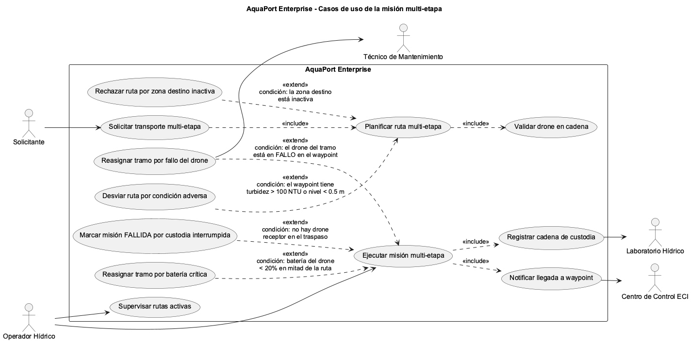

# Empoleon · Reto 10 - Casos de uso Enterprise con flujos de fallo

| Extensión | Caso base | Condición |
|---|---|---|
| Reasignar tramo por fallo del drone | Ejecutar misión multi-etapa | El drone del tramo está en FALLO en el waypoint |
| Desviar ruta por condición adversa | Planificar ruta multi-etapa | El waypoint tiene turbidez mayor a 100 NTU o nivel menor a 0.5 m |
| Rechazar ruta por zona destino inactiva | Planificar ruta multi-etapa | La zona destino está inactiva |
| Marcar misión FALLIDA por custodia interrumpida | Ejecutar misión multi-etapa | No hay drone receptor en el traspaso |
| Reasignar tramo por batería crítica | Ejecutar misión multi-etapa | Batería del drone menor a 20% en mitad de la ruta |

Inclusiones obligatorias: la solicitud siempre incluye la planificación; la planificación siempre valida cada drone con la cadena; la ejecución siempre registra la cadena de custodia y notifica cada waypoint.
