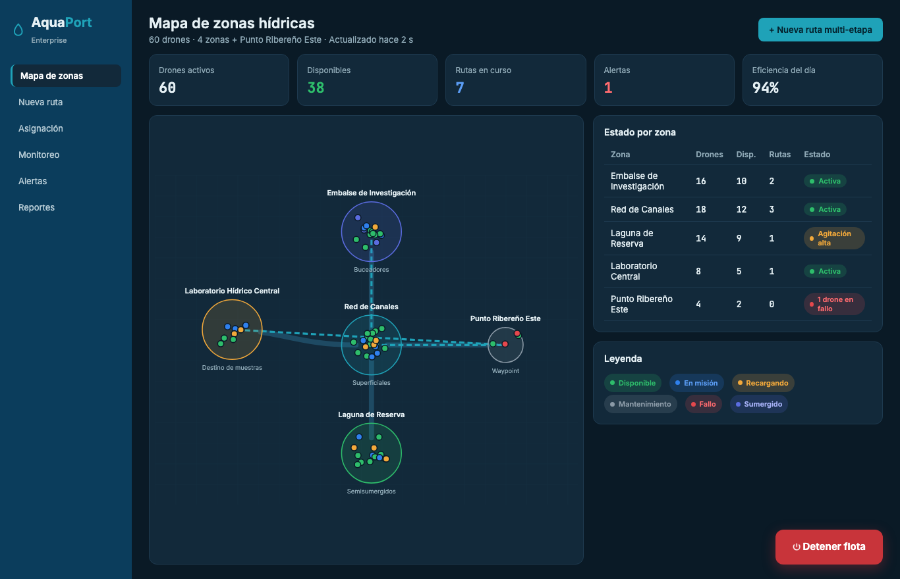
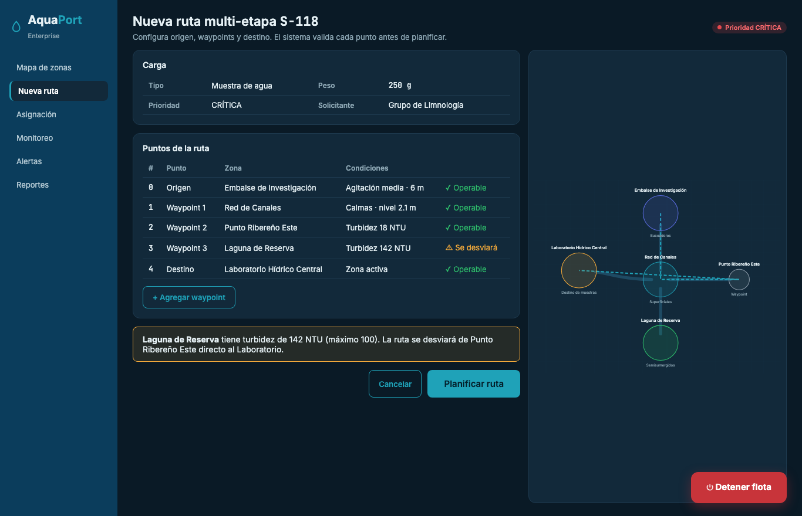
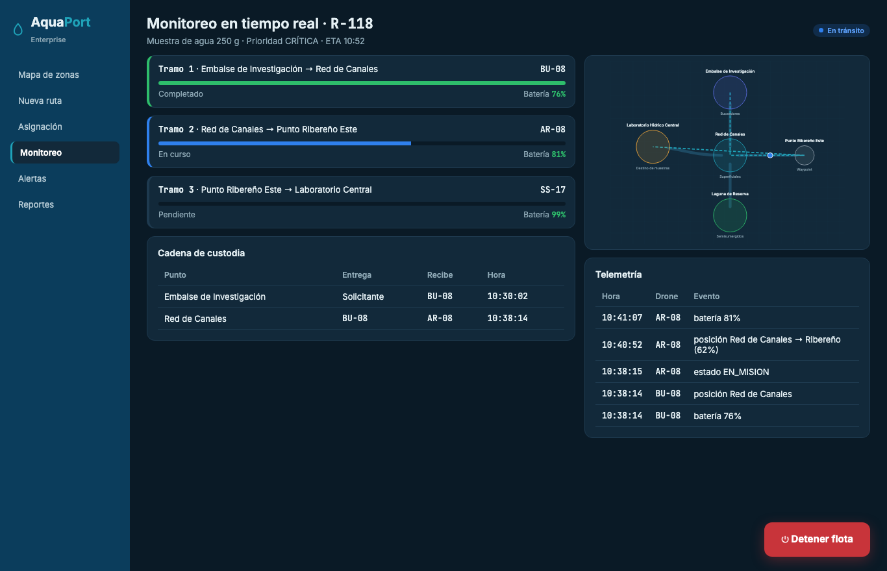
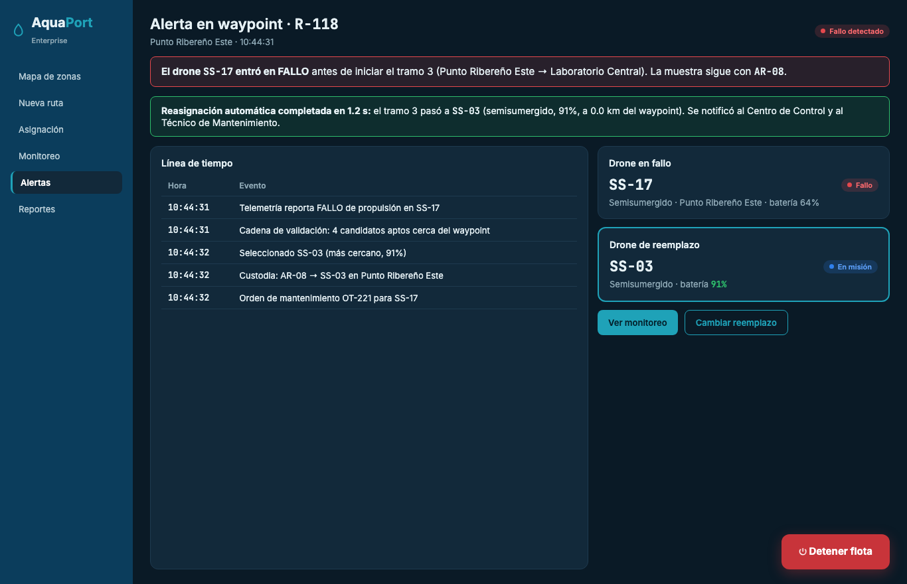
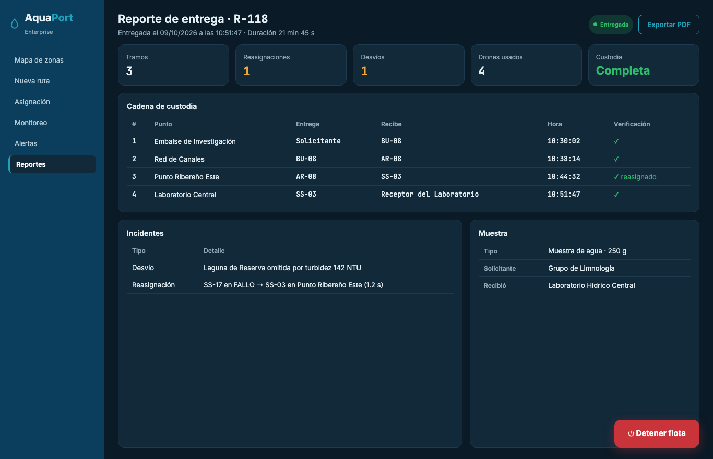
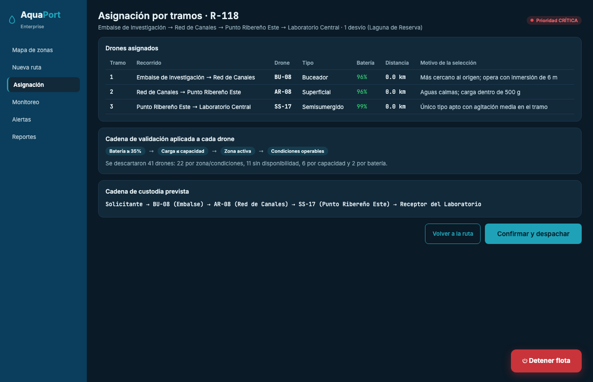

# Empoleon · Reto 11 - Mocks del flujo Enterprise

Todos los prompts comparten el bloque de estilo tomado del [design system](08-design-system.md):

```
ESTILO: Dashboard técnico oscuro de AquaPort Enterprise. Tokens: fondo #0A1A26, superficie
#12293A, borde #1E3A4F, navegación #0B3D5C, acción #1FA2B8, emergencia #C8343A, texto
#E6F1F5 y #8FA9B6. Estados (indicador/texto): DISPONIBLE #2EBD6B, EN_MISION #2F80ED/#5B9DF5,
RECARGANDO #F2A93B, MANTENIMIENTO #8A99A6, FALLO #E5484D/#FF6B6F, SUMERGIDO #5B6CE0/#A5B0F5.
Inter para la interfaz y JetBrains Mono para IDs, porcentajes y horas. Espaciado en escala
de 4 px, radios de 8 px en botones y 12 px en tarjetas. Botón "Detener flota" fijo abajo a
la derecha. Contraste WCAG AA en todos los textos.
```

## Prompt 1 - Mapa de las 4 zonas hídricas en tiempo real

```
Actúa como diseñador UX/UI senior de centros de control ambiental.
SISTEMA: AquaPort Enterprise (60 drones acuáticos de la ECI).
PANTALLA: Mapa esquemático de zonas con drones en tiempo real.
[ESTILO]
DATOS: Embalse de Investigación (norte, buceadores, 16 drones), Red de Canales (centro,
superficiales, 18), Laguna de Reserva (sur, semisumergidos, 14, agitación alta), Laboratorio
Hídrico Central (destino de muestras, 8) y Punto Ribereño Este (waypoint, 4, uno en FALLO).
Puntos de color por estado dentro de cada zona y la ruta R-118 punteada.
Indicadores: 60 activos, 38 disponibles, 7 rutas, 1 alerta, eficiencia 94%.
Tabla lateral con drones, disponibles, rutas y estado por zona.
```



## Prompt 2 - Configuración de ruta multi-etapa con waypoints

```
Actúa como diseñador UX/UI senior de centros de control ambiental.
SISTEMA: AquaPort Enterprise.
PANTALLA: Formulario de la ruta S-118, prioridad CRÍTICA.
[ESTILO]
DATOS: Muestra de agua de 250 g del Grupo de Limnología. Puntos: origen Embalse de
Investigación (agitación media, 6 m), waypoint Red de Canales (calmas), waypoint Punto
Ribereño Este (18 NTU), waypoint Laguna de Reserva (142 NTU, se desviará), destino
Laboratorio Hídrico Central. Banner ámbar explicando el desvío. Mapa con la ruta.
ACCIONES: agregar waypoint, cancelar, "Planificar ruta" como acción principal.
```



## Prompt 3 - Monitoreo del progreso por tramo

```
Actúa como diseñador UX/UI senior de centros de control ambiental.
SISTEMA: AquaPort Enterprise.
PANTALLA: Monitoreo en tiempo real de la ruta R-118 (en tránsito, ETA 10:52).
[ESTILO]
DATOS: Tramo 1 Embalse → Red de Canales por BU-08, completado, 76%. Tramo 2 Red de Canales →
Punto Ribereño Este por AR-08, en curso 62%, 81%. Tramo 3 Punto Ribereño Este → Laboratorio
por SS-17, pendiente, 99%. Tabla de cadena de custodia con hora de cada traspaso. Mapa con
la posición del drone y tabla de telemetría (hora, drone, evento).
```



## Prompt 4 - Alerta de fallo en waypoint con reasignación automática visible

```
Actúa como diseñador UX/UI senior de centros de control ambiental.
SISTEMA: AquaPort Enterprise.
PANTALLA: Alerta de la ruta R-118 en Punto Ribereño Este a las 10:44:31.
[ESTILO]
DATOS: SS-17 (semisumergido, 64%) entra en FALLO antes del tramo 3; la muestra sigue con
AR-08. Banner verde: reasignación automática en 1.2 s a SS-03 (91%). Línea de tiempo con
la detección, la cadena de validación, la selección, el traspaso de custodia AR-08 → SS-03
y la orden de mantenimiento OT-221. Tarjetas del drone en fallo y del reemplazo.
ACCIONES: ver monitoreo, cambiar reemplazo.
Nielsen #9 y Von Restorff: la alerta debe ser el elemento más llamativo.
```



## Prompt 5 - Reporte final de la cadena de custodia

```
Actúa como diseñador UX/UI senior de centros de control ambiental.
SISTEMA: AquaPort Enterprise.
PANTALLA: Reporte de entrega de la ruta R-118 (entregada 10:51:47, 21 min 45 s).
[ESTILO]
DATOS: Indicadores: 3 tramos, 1 reasignación, 1 desvío, 4 drones usados, custodia completa.
Tabla de custodia: Solicitante → BU-08 (Embalse, 10:30:02), BU-08 → AR-08 (Red de Canales,
10:38:14), AR-08 → SS-03 (Punto Ribereño Este, 10:44:32, reasignado), SS-03 → Receptor
del Laboratorio (10:51:47). Incidentes: desvío por Laguna de Reserva y reasignación de SS-17.
ACCIÓN: exportar PDF.
```



## Pantalla adicional - Asignación por tramos

Se diseñó también la pantalla intermedia del mapa de flujos, con el mismo bloque de estilo y los datos de los drones elegidos por tramo (BU-08, AR-08, SS-17), el motivo de cada selección y la cadena de validación aplicada.


