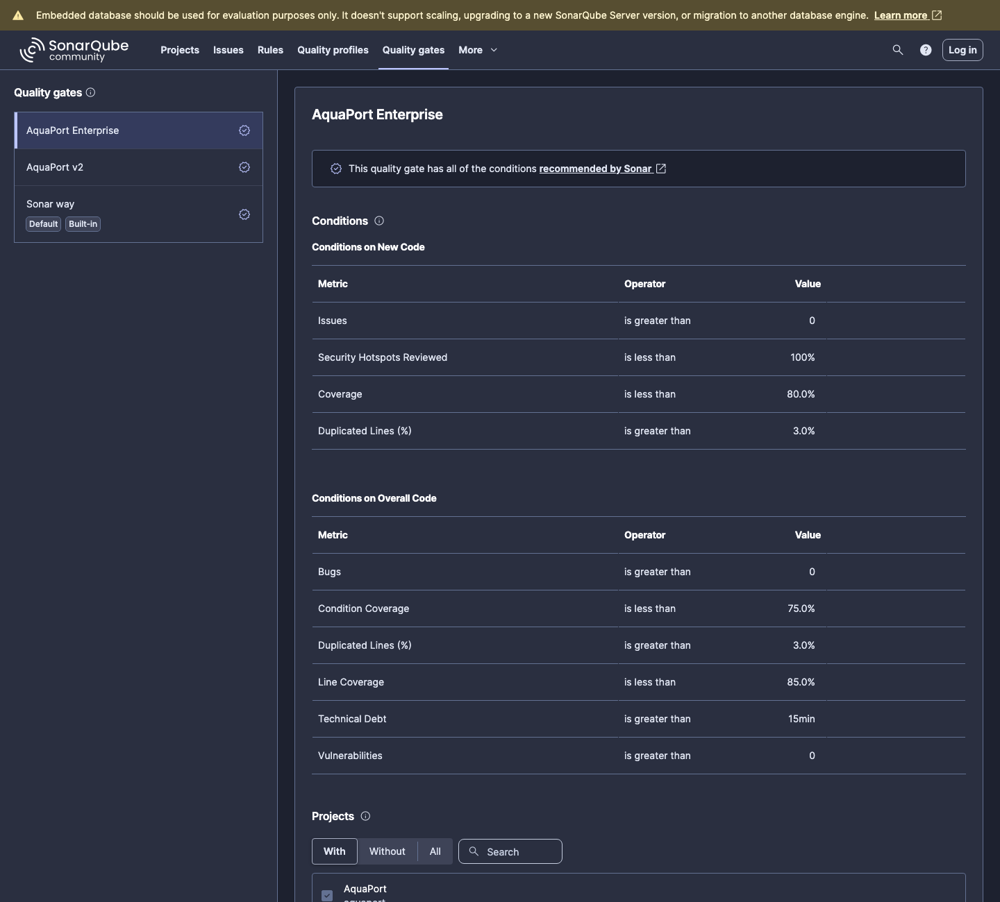
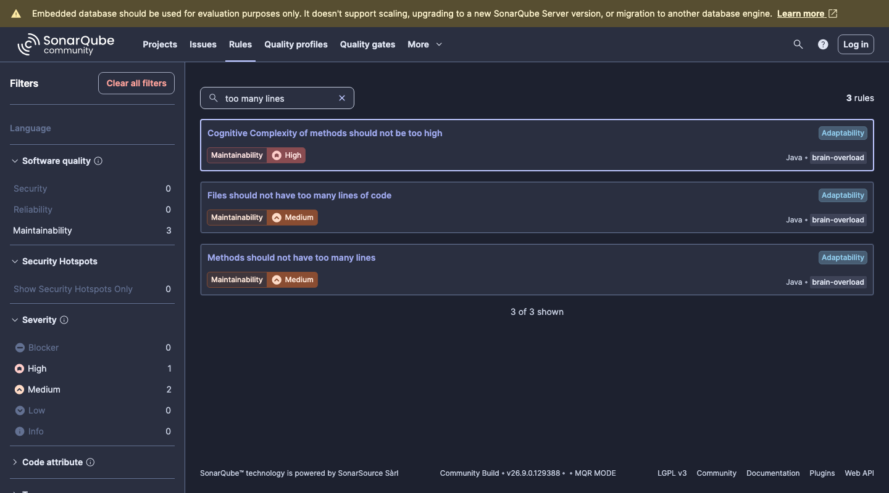
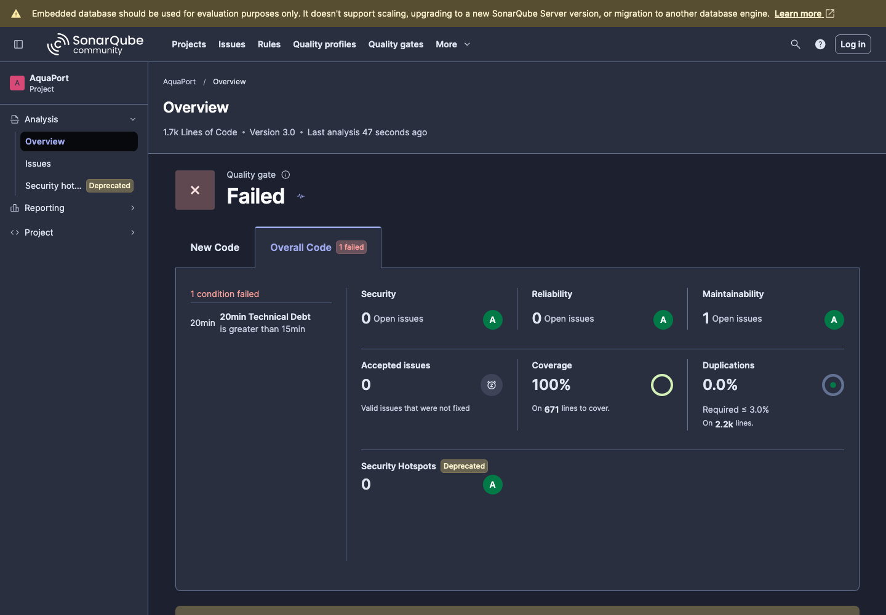
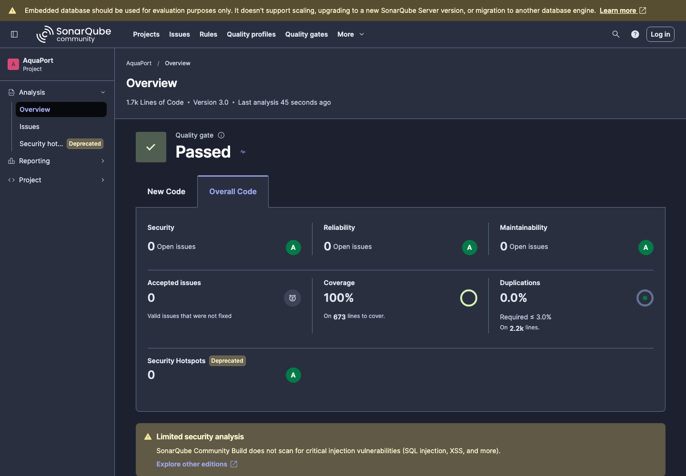
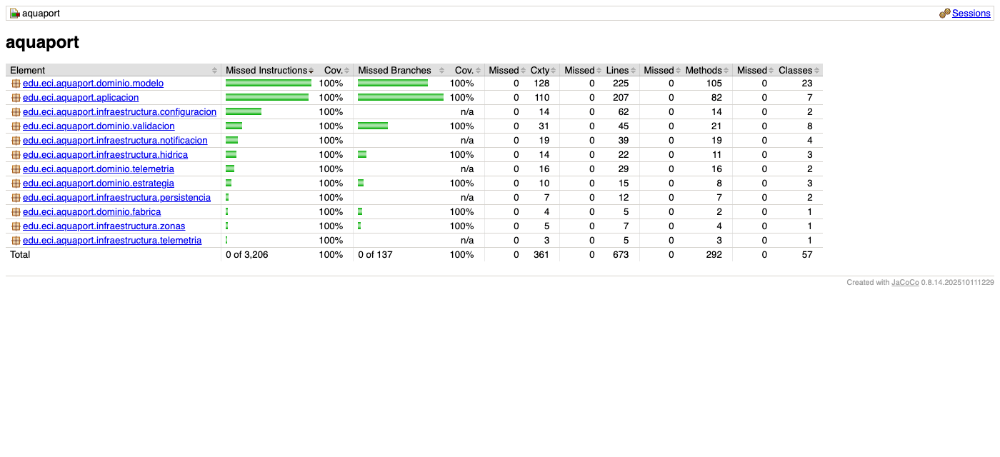
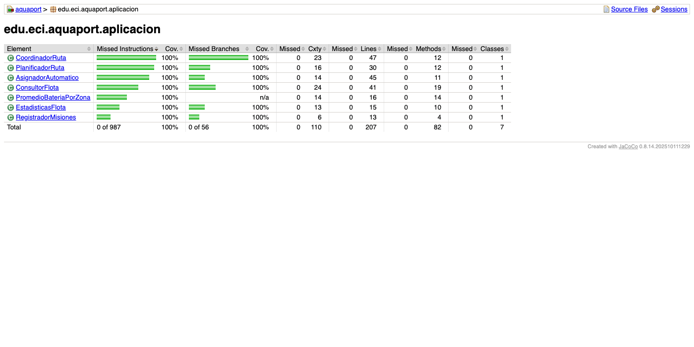

# Empoleon · Reto 13 - Quality gate Enterprise (JaCoCo + SonarQube)

## Configuración

**JaCoCo (`pom.xml`, fase `verify`):**

| Regla | Elemento | Mínimo |
|---|---|---|
| Líneas | Cada clase | 85% |
| Ramas | Proyecto | 75% |

**SonarQube:**

- Quality gate **AquaPort Enterprise**, asignado al proyecto.
- Perfil de calidad **AquaPort Enterprise**: copia de *Sonar way* con dos reglas adicionales para los estándares del nivel:
  - `java:S138`: métodos de 15 líneas como máximo.
  - `java:S104`: archivos de 150 líneas de código como máximo.

## Evolución de los estándares

| Métrica | MVP (Piplup) | v2 (Prinplup) | Enterprise (Empoleon) | Resultado v3 |
|---|---|---|---|---|
| Line coverage | 80% | 80% | ≥85% | 100% |
| Branch coverage | — | 70% | ≥75% | 100% |
| Bugs | 0 | 0 | 0 | 0 |
| Vulnerabilidades | 0 | 0 | 0 | 0 |
| Deuda técnica | 0 | <30 min | <15 min | 0 min |
| Duplicación | — | <5% | <3% | 0.0% |

## Primer análisis Enterprise

El primer análisis con el perfil nuevo dejó el quality gate en rojo por deuda técnica de 20 minutos.

## Issues encontrados y corregidos

| Herramienta | Issue | Causa raíz | Corrección | Commit |
|---|---|---|---|---|
| JaCoCo | Rama amarilla en `PlanificadorRuta.requiereDesvio` | Solo se probaba el desvío por condiciones adversas, no el de un waypoint en zona inactiva. | Prueba `waypointInactivo_seDesvia`. | `test(rutas): cubrir el desvío por waypoint en zona inactiva` |
| SonarQube | `java:S138` en `Mision.Builder.build` (16 líneas) | Al agregar los waypoints se sumó una validación más dentro de `build`. | La validación de campos pasó al método `validarCampos`. | `refactor(dominio): separar la validación de campos del método build de Mision` |

Ningún issue se suprimió.

## Resultado final

Además, ninguna clase supera las 150 líneas y SonarQube no reporta métodos de más de 15 líneas.
