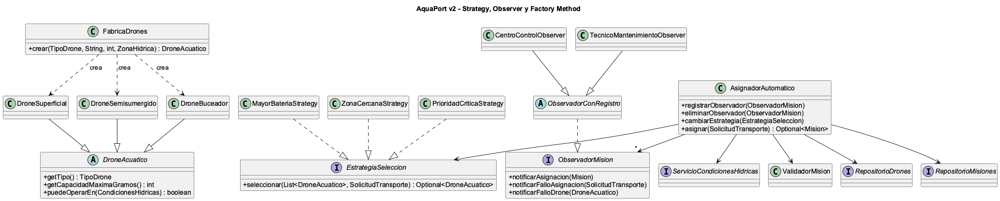

# Prinplup · Reto 03 - Strategy, Observer y Factory Method

## Factory Method: `FabricaDrones`

`FabricaDrones.crear(tipo, id, bateria, zona)` decide qué subclase de `DroneAcuatico` crear (`DroneSuperficial`, `DroneSemisumergido` o `DroneBuceador`). El resto del sistema trabaja con `DroneAcuatico` y no necesita saber qué clase concreta se creó.

| Tipo | Carga máxima | Opera en |
|---|---|---|
| Superficial | 500 g | Agua calmada y sin inmersión |
| Semisumergido | 1500 g | Cualquier agitación, sin inmersión |
| Buceador | 300 g | Profundidad, excepto con agitación alta |

## Strategy: `EstrategiaSeleccion`

`AsignadorAutomatico` recibe la estrategia por constructor y puede cambiarla con `cambiarEstrategia`. Nunca pregunta qué estrategia tiene (no hay `instanceof`), solo llama a `seleccionar`.

| Estrategia | Criterio |
|---|---|
| `MayorBateriaStrategy` | El drone con más batería |
| `ZonaCercanaStrategy` | El drone más cercano al origen; si empatan, el de más batería |
| `PrioridadCriticaStrategy` | Para misiones CRÍTICAS, el tipo recomendado para la zona destino; si no es crítica, usa la mayor batería |

## Observer: `ObservadorMision`

`AsignadorAutomatico` mantiene una lista de observadores (`registrarObservador`, `eliminarObservador`) y les avisa cuando:

- se asigna una misión (`notificarAsignacion`),
- una solicitud se queda sin drone (`notificarFalloAsignacion`),
- un drone entra en `FALLO` al ser seleccionado (`notificarFalloDrone`). En ese caso el asignador descarta ese drone y pide otro a la estrategia.

Observadores implementados: `CentroControlObserver` y `TecnicoMantenimientoObserver`. Ambos heredan de `ObservadorConRegistro`, que guarda y registra los mensajes para no repetir ese código.

## Prueba con Mockito

`AsignadorAutomaticoTest.droneEnFallo_notificaYBuscaAlternativo` registra dos observadores simulados. La estrategia simulada devuelve primero un drone que pasa a `FALLO` y luego uno alternativo. La prueba verifica con `verify(observador, times(1)).notificarFalloDrone(drone)` que cada observador recibe la alerta exactamente una vez y que la misión queda asignada al drone alternativo.
