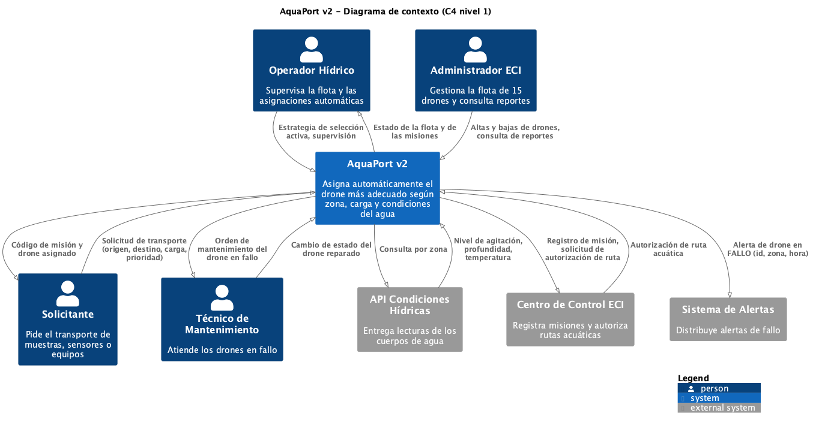

# Prinplup · Reto 05 - Diagrama de contexto de la v2

## Flujos con sistemas externos

| Origen | Destino | Datos |
|---|---|---|
| AquaPort v2 | API Condiciones Hídricas | Consulta por zona |
| API Condiciones Hídricas | AquaPort v2 | Nivel de agitación, profundidad, temperatura |
| AquaPort v2 | Centro de Control ECI | Registro de misión, solicitud de autorización de ruta |
| Centro de Control ECI | AquaPort v2 | Autorización de ruta acuática |
| AquaPort v2 | Sistema de Alertas | Alerta de drone en FALLO (id, zona, hora) |
| AquaPort v2 | Técnico de Mantenimiento | Orden de mantenimiento del drone en fallo |
| Técnico de Mantenimiento | AquaPort v2 | Cambio de estado del drone reparado |

## Comparación MVP vs v2

| Aspecto | MVP (Piplup) | v2 (Prinplup) |
|---|---|---|
| Actores | Operador, Solicitante, Administrador | Los mismos más el **Técnico de Mantenimiento** |
| Sistemas externos | Ninguno | **API Condiciones Hídricas**, **Centro de Control ECI**, **Sistema de Alertas** |
| Papel del operador | Asigna drones manualmente | Supervisa y elige la estrategia; el sistema asigna |
| Lo que recibe el solicitante | Código de misión | Código de misión y drone asignado |

**Qué creció:** el sistema ahora depende de información externa (condiciones del agua) y avisa a otros sistemas (centro de control y alertas). Aparece un nuevo rol para atender los fallos.

**Qué se mantuvo:** los tres actores originales, el propósito del sistema (transportar muestras entre las zonas hídricas del campus) y la regla de mostrar solo lo que se ve desde afuera, sin clases internas.
