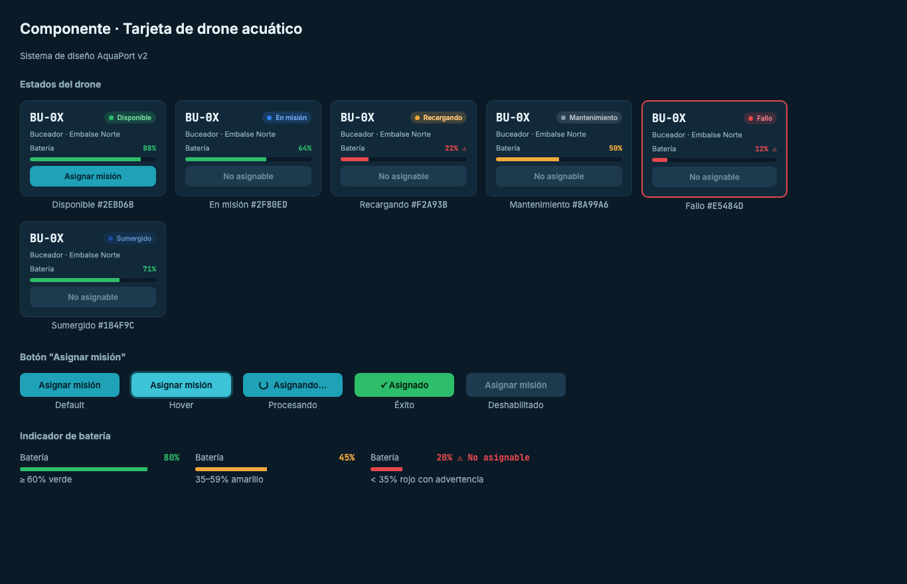

# Prinplup · Reto 08 - Sistema de diseño v2 y leyes UX

La v2 mantiene la identidad del [manual del MVP](../08-manual-identidad.md): Azul Embalse `#0B3D5C`, Cian Técnico `#1FA2B8`, fondo `#0A1A26`, tipografías Inter y JetBrains Mono. Se agregan el estado **Sumergido** y nuevas reglas para el indicador de batería.

## Componente "Tarjeta de drone acuático"

| Estado | Color | Comportamiento |
|---|---|---|
| Disponible | Verde `#2EBD6B` | Botón "Asignar misión" activo |
| En misión | Azul `#2F80ED` | Botón deshabilitado |
| Recargando | Ámbar `#F2A93B` | Botón deshabilitado |
| Mantenimiento | Gris `#8A99A6` | Botón deshabilitado |
| Fallo | Rojo `#E5484D` | Borde rojo grueso y botón deshabilitado |
| Sumergido | Azul oscuro `#1B4F9C` | Botón deshabilitado |

### Botón "Asignar misión"

| Estado | Apariencia |
|---|---|
| Default | Fondo cian `#1FA2B8` |
| Hover | Cian más claro `#3CC3D8` con halo |
| Procesando | Spinner y texto "Asignando…" |
| Éxito | Fondo verde con "✓ Asignado" |
| Deshabilitado | Fondo `#1E3A4F` y texto gris |

### Indicador de batería

| Rango | Color | Detalle |
|---|---|---|
| 60% o más | Verde | — |
| 35% a 59% | Amarillo | Asignable |
| Menos de 35% | Rojo | Ícono ⚠ y texto "No asignable" |

## Flujo de asignación automática

| Pantalla | Imagen |
|---|---|
| 1. Panel de flota (15 drones agrupados por tipo) |  |
| 2. Detalle de la misión con drone recomendado |  |
| 3. Confirmación con la flota actualizada |  |

## Leyes UX aplicadas

| Ley | Dónde | Cómo |
|---|---|---|
| **Fitts** | Botón "Detener flota" | Es el botón de emergencia: está siempre en la esquina inferior derecha, es el más grande de la pantalla (16 px de alto de relleno, texto de 15 px) y tiene color rojo. Las esquinas son puntos fáciles de alcanzar con el mouse y el tamaño reduce el tiempo para llegar a él. El botón "Confirmar asignación" también es más grande que "Cambiar drone" porque es la acción principal. |
| **Hick** | Panel de flota | En lugar de una lista de 15 tarjetas, los drones se agrupan en 3 bloques por tipo (Superficial, Semisumergido, Buceador) y cada bloque indica cuántos están disponibles. El operador primero elige el tipo y luego mira solo 4 a 6 opciones, lo que reduce el tiempo de decisión. |
| **Miller** | Tarjetas y resumen | Cada tarjeta muestra solo 4 datos (ID, estado, zona y batería) y el resumen superior tiene 6 contadores, dentro del rango de 7 ± 2 elementos que se pueden retener de un vistazo. |
