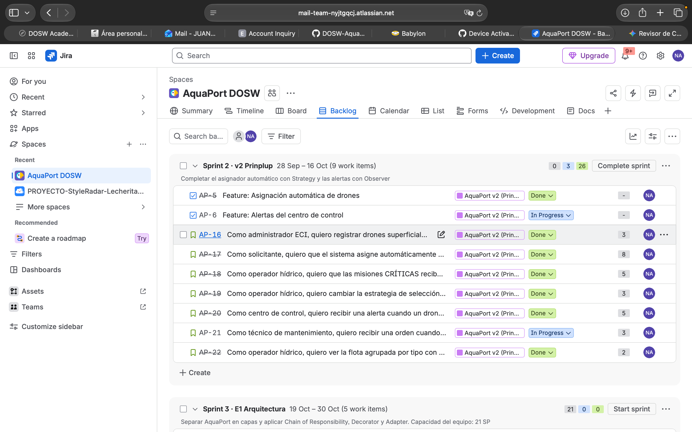

# Prinplup · Reto 09 - Sprint planning de la v2 en Jira

Proyecto: **AquaPort DOSW** (`AP`) · Épica [AP-2](https://mail-team-nyjtgqcj.atlassian.net/browse/AP-2)

## Sprint 2 · v2 Prinplup

| Campo | Valor |
|---|---|
| Sprint Goal | Completar el asignador automático con Strategy y las alertas con Observer |
| Fechas | 28 de septiembre al 16 de octubre de 2026 |
| Estado | Activo |
| Comprometido | 29 story points |

## Historias con estimación (Fibonacci)

| Ticket | Historia | Feature | SP |
|---|---|---|---|
| [AP-16](https://mail-team-nyjtgqcj.atlassian.net/browse/AP-16) | Como administrador ECI, quiero registrar drones superficiales, semisumergidos y buceadores, para tener una flota especializada por tipo de zona | [AP-5](https://mail-team-nyjtgqcj.atlassian.net/browse/AP-5) Asignación automática | 3 |
| [AP-17](https://mail-team-nyjtgqcj.atlassian.net/browse/AP-17) | Como solicitante, quiero que el sistema asigne automáticamente el drone más adecuado a mi solicitud, para no depender de que un operador elija manualmente | AP-5 | 8 |
| [AP-18](https://mail-team-nyjtgqcj.atlassian.net/browse/AP-18) | Como operador hídrico, quiero que las misiones CRÍTICAS reciban el drone más apto para la zona, para que las muestras urgentes no se pierdan | AP-5 | 5 |
| [AP-19](https://mail-team-nyjtgqcj.atlassian.net/browse/AP-19) | Como operador hídrico, quiero cambiar la estrategia de selección activa, para adaptar la asignación a la situación de la flota | AP-5 | 3 |
| [AP-22](https://mail-team-nyjtgqcj.atlassian.net/browse/AP-22) | Como operador hídrico, quiero ver la flota agrupada por tipo con promedios de batería y zonas cubiertas, para decidir rápido con 15 drones | AP-5 | 2 |
| [AP-20](https://mail-team-nyjtgqcj.atlassian.net/browse/AP-20) | Como centro de control, quiero recibir una alerta cuando un drone entra en FALLO o una solicitud se queda sin drone, para reaccionar a tiempo | [AP-6](https://mail-team-nyjtgqcj.atlassian.net/browse/AP-6) Alertas | 5 |
| [AP-21](https://mail-team-nyjtgqcj.atlassian.net/browse/AP-21) | Como técnico de mantenimiento, quiero recibir una orden cuando un drone falla, para repararlo y devolverlo a la flota | AP-6 | 3 |

**Velocidad de referencia:** en el Sprint 1 se completaron 8 de 10 SP. Para el Sprint 2 (tres semanas) se comprometieron 29 SP.

## Definition of Done de la v2

- El código compila sin warnings.
- Las pruebas unitarias pasan (JUnit 5).
- JaCoCo reporta 80% o más de line coverage para la feature.
- El PR tiene revisión aprobada por al menos otro miembro.
- El diagrama C4 y la plantilla DOSW están actualizados.

El DoD también quedó registrado en la descripción de la épica AP-2.

## Captura del sprint activo

