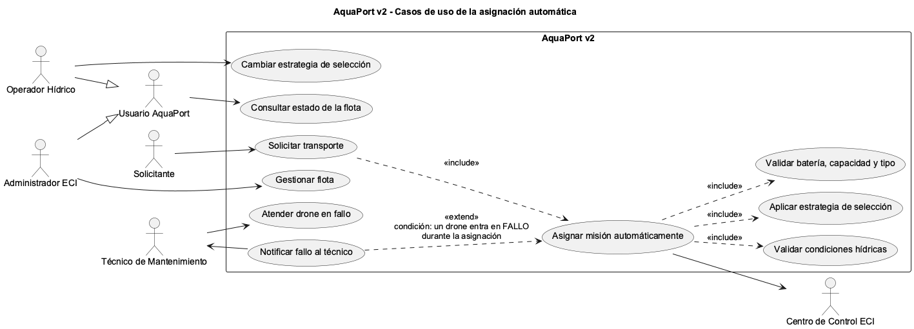

# Prinplup · Reto 10 - Casos de uso de la asignación automática

| Elemento | Explicación |
|---|---|
| Generalización | `Operador Hídrico` y `Administrador ECI` heredan de `Usuario AquaPort`, por eso ambos pueden consultar el estado de la flota. |
| `<<include>>` Validar condiciones hídricas | Siempre se consulta el estado del agua de la zona destino antes de elegir drone. |
| `<<include>>` Aplicar estrategia de selección | Siempre se usa la estrategia activa para elegir. |
| `<<include>>` Validar batería, capacidad y tipo | Siempre se descartan los drones que no cumplen las reglas. |
| `<<extend>>` Notificar fallo al técnico | Solo ocurre si un drone entra en FALLO durante la asignación. |
| Nuevos actores | Técnico de Mantenimiento (recibe la notificación y atiende el drone) y Centro de Control ECI (recibe el registro de la misión). |
