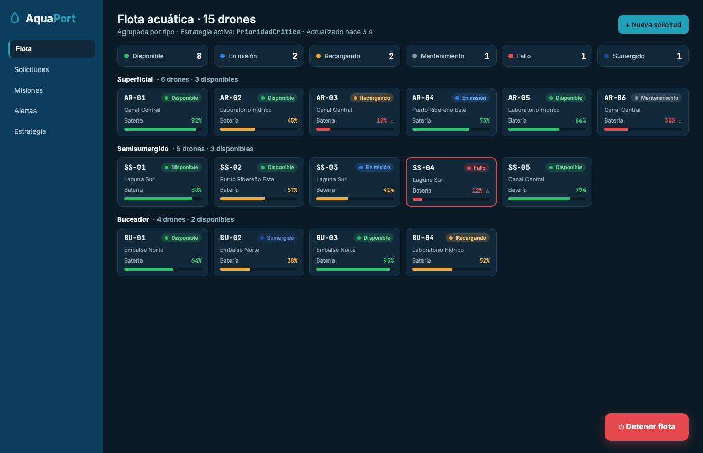
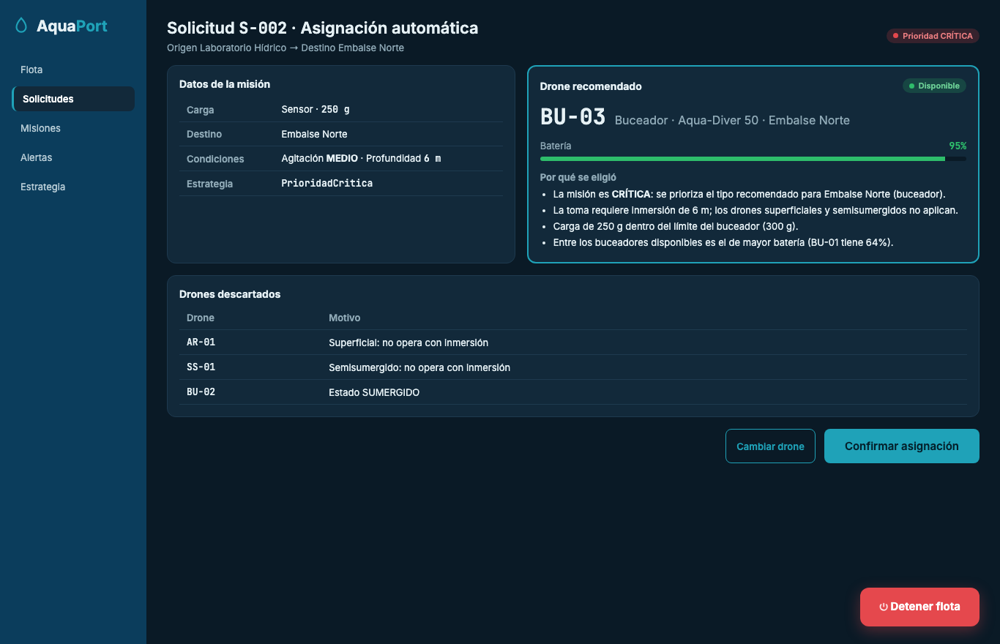
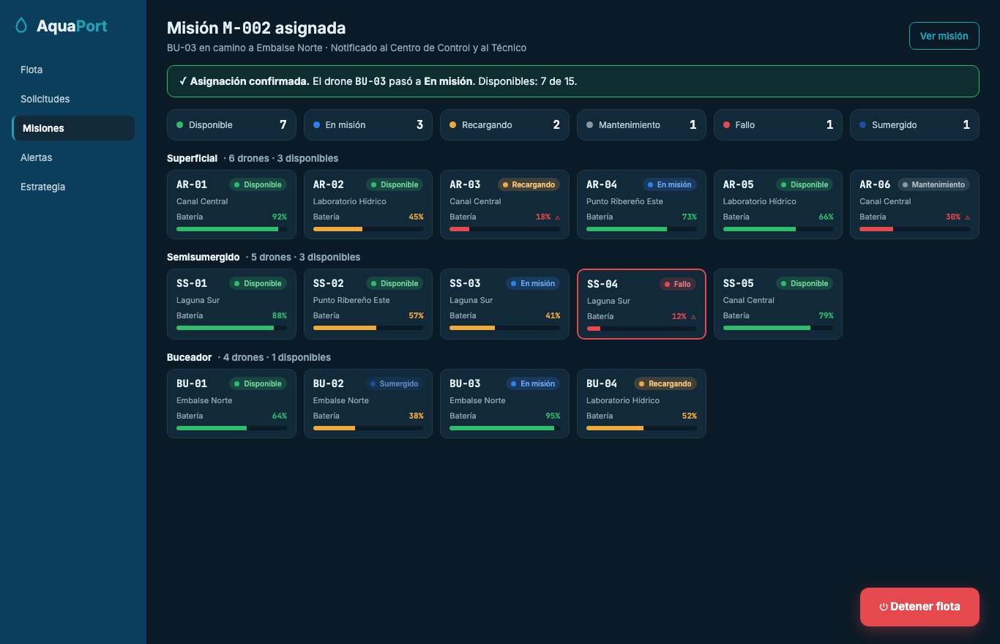
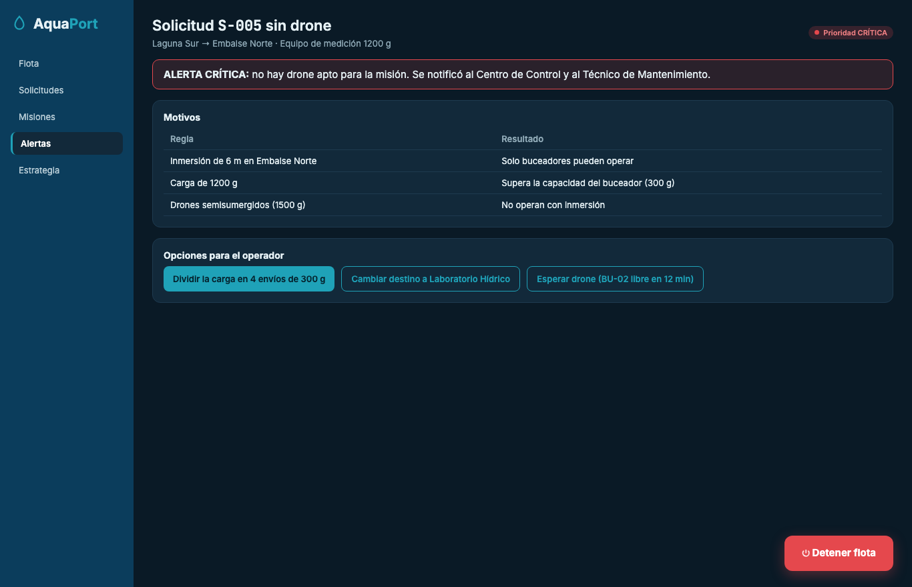

# Prinplup · Reto 11 - Mocks del flujo de asignación automática

Los cuatro prompts parten de la identidad definida y de los datos del RF AP-07. Todos comparten este bloque de estilo:

```
ESTILO: Dashboard técnico oscuro. Fondo #0A1A26, tarjetas #12293A, navegación #0B3D5C,
acción #1FA2B8. Tipografía Inter para la interfaz y JetBrains Mono para IDs, porcentajes
y códigos. Estados del drone: DISPONIBLE #2EBD6B, EN_MISION #2F80ED, RECARGANDO #F2A93B,
MANTENIMIENTO #8A99A6, FALLO #E5484D, SUMERGIDO #1B4F9C. Batería: verde >= 60%,
amarillo 35-59%, rojo < 35% con ícono de advertencia. Botón de emergencia "Detener flota"
rojo, grande y fijo en la esquina inferior derecha.
```

## Prompt 1 - Panel de flota

```
Actúa como diseñador UX/UI senior de sistemas de monitoreo ambiental.
SISTEMA: AquaPort v2 — asignación automática de drones acuáticos de la ECI.
PANTALLA: Panel de flota (vista principal del operador).
[ESTILO]
DATOS: 15 drones agrupados por tipo. Superficial: AR-01 a AR-06. Semisumergido: SS-01 a SS-05.
Buceador: BU-01 a BU-04. Cada tarjeta muestra ID, estado, zona y batería. Incluir un drone
en FALLO (SS-04, 12%) y uno SUMERGIDO (BU-02).
Encabezado con la estrategia activa (PrioridadCritica) y resumen de cantidad por estado.
Leyes UX: Hick (agrupar por tipo con contador de disponibles), Fitts (botón de emergencia).
```



## Prompt 2 - Detalle de la misión

```
Actúa como diseñador UX/UI senior de sistemas de monitoreo ambiental.
SISTEMA: AquaPort v2.
PANTALLA: Detalle de la solicitud S-002 con el drone recomendado por el sistema.
[ESTILO]
DATOS: Origen Laboratorio Hídrico, destino Embalse Norte, sensor de 250 g, prioridad CRÍTICA,
condiciones: agitación MEDIO y profundidad 6 m, estrategia PrioridadCritica.
Drone recomendado: BU-03, buceador, 95%. Mostrar la razón de la selección en 4 puntos
y una tabla de drones descartados con su motivo (AR-01, SS-01, BU-02).
ACCIONES: "Confirmar asignación" (principal, más grande) y "Cambiar drone" (secundaria).
```



## Prompt 3 - Confirmación

```
Actúa como diseñador UX/UI senior de sistemas de monitoreo ambiental.
SISTEMA: AquaPort v2.
PANTALLA: Confirmación de la asignación de la misión M-002.
[ESTILO]
DATOS: Mensaje de éxito verde indicando que BU-03 pasó a "En misión" y que se notificó al
Centro de Control y al Técnico. Mostrar la misma flota de 15 drones agrupada por tipo con
BU-03 ya en estado EN_MISION y el resumen actualizado (7 disponibles).
```



## Prompt 4 - Alerta de misión CRÍTICA sin drone

```
Actúa como diseñador UX/UI senior de sistemas de monitoreo ambiental.
SISTEMA: AquaPort v2.
PANTALLA: Alerta de la solicitud S-005 (CRÍTICA) sin drone disponible.
[ESTILO]
DATOS: Laguna Sur → Embalse Norte, equipo de medición de 1200 g. Banner rojo de alerta
crítica. Tabla de motivos: inmersión de 6 m (solo buceadores), carga mayor a 300 g
(capacidad del buceador), semisumergidos no operan con inmersión.
ACCIONES: dividir la carga, cambiar destino, esperar drone (indicar cuándo se libera).
Nielsen #9: el mensaje debe explicar el problema y proponer soluciones.
```



## Heurísticas de Nielsen

| Heurística | Dónde se cumple |
|---|---|
| #1 Visibilidad del estado | Resumen por estado, chip de color en cada tarjeta, banner de confirmación y de alerta. |
| #3 Control del usuario | En el detalle el operador puede cambiar el drone antes de confirmar; el botón de emergencia siempre está visible. |
| #5 Prevención de errores | Botones "No asignable" deshabilitados y batería roja con advertencia por debajo de 35%. |
| #8 Diseño minimalista | Cada tarjeta muestra solo 4 datos. |
| #9 Ayudar a reconocer y corregir errores | La alerta explica por qué no hay drone y ofrece tres opciones concretas. |
| #10 Ayuda y documentación | El detalle explica por qué se eligió el drone y por qué se descartaron los demás. |
