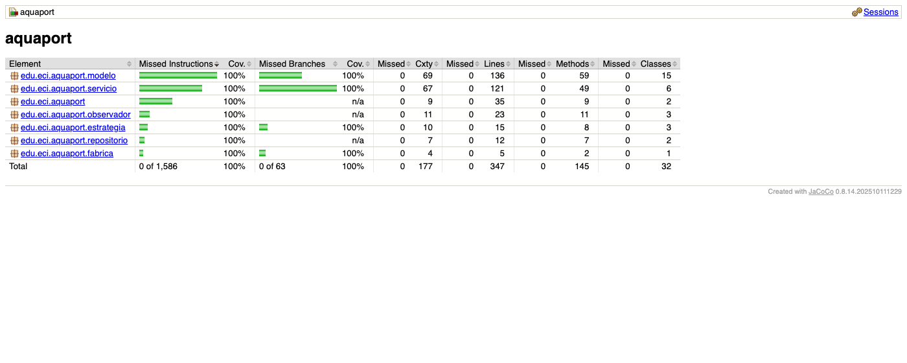
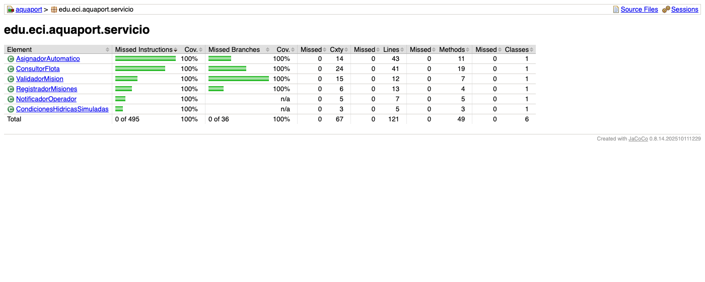
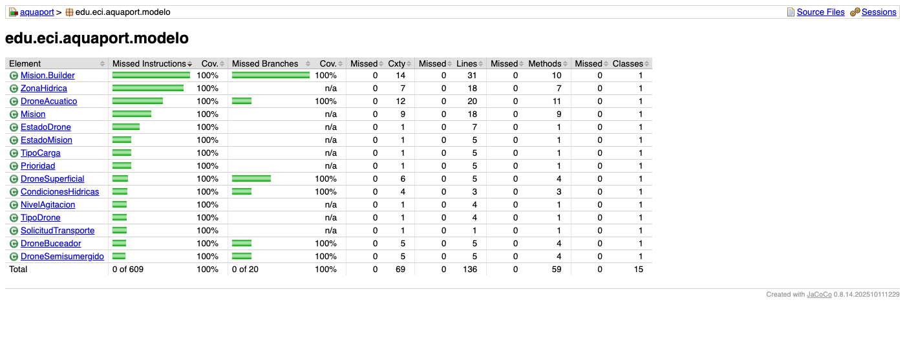
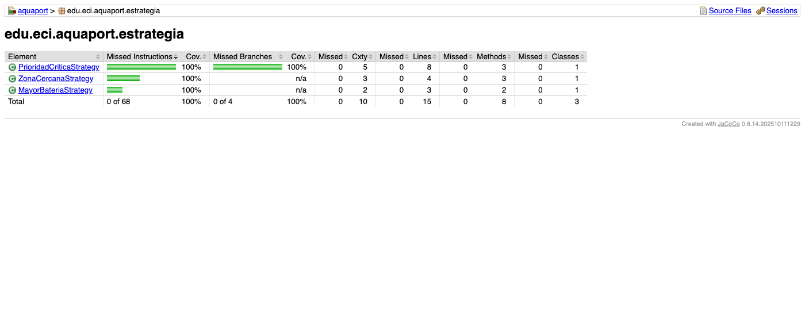

# Prinplup · Reto 13 - Quality gate de JaCoCo

## Configuración

En el `pom.xml` se agregó la ejecución `check` del plugin de JaCoCo en la fase `verify`, con dos reglas:

| Regla | Elemento | Contador | Mínimo |
|---|---|---|---|
| Cobertura de líneas | Cada clase (`CLASS`) | `LINE` | 80% |
| Cobertura de ramas | Proyecto completo (`BUNDLE`) | `BRANCH` | 70% |

Si cualquier clase baja de 80% de líneas o el proyecto baja de 70% de ramas, `mvn verify` termina con `BUILD FAILURE` y muestra qué regla se incumplió.

```bash
mvn clean verify
```

## Resultado

| Paquete | Líneas | Ramas |
|---|---|---|
| modelo | 100% | 100% |
| servicio (incluye `AsignadorAutomatico`) | 100% | 100% |
| estrategia | 100% | 100% |
| observador | 100% | n/a |
| fabrica | 100% | 100% |
| repositorio | 100% | n/a |









## Ramas amarillas encontradas y corregidas

| Clase | Rama sin cubrir | Prueba agregada | Por qué es importante |
|---|---|---|---|
| `DroneSuperficial.puedeOperarEn` | Agua calmada (`BAJO`) pero con inmersión requerida | `superficial_noOperaConInmersion` | Sin esta prueba no se verifica que un drone superficial nunca se asigne a una toma de muestras en profundidad, aunque el agua esté tranquila. Un error en esa condición enviaría un drone que no puede sumergirse. |

Las demás ramas de la v2 quedaron cubiertas desde el desarrollo con TDD: prioridades en `PrioridadCriticaStrategy` (crítica y no crítica), drone en `FALLO` durante la selección en `AsignadorAutomatico`, flota vacía y batería en el umbral de 35%.
