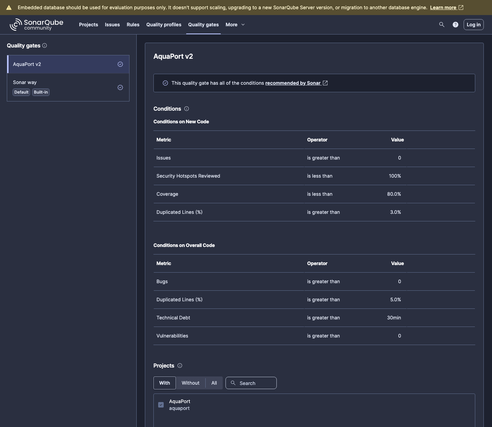
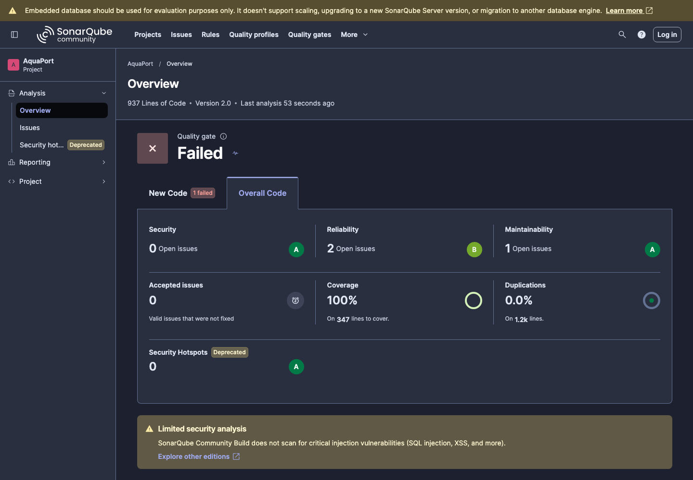
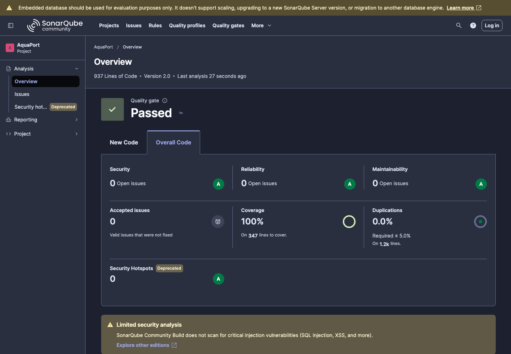

# Prinplup · Reto 14 - SonarQube en la v2

## Quality gate "AquaPort v2"

Se creó un quality gate propio y se asignó al proyecto con las condiciones del nivel:

| Indicador | Condición | Resultado |
|---|---|---|
| Bugs | 0 | 0 |
| Vulnerabilidades | 0 | 0 |
| Deuda técnica | menor a 30 min | 0 min |
| Duplicación | menor a 5% | 0.0% |

## Primer análisis de la v2

| Tipo | Cantidad |
|---|---|
| Bugs | 2 |
| Vulnerabilidades | 0 |
| Code smells | 1 |
| Deuda técnica | 11 min |

## Issues resueltos

| Regla | Causa raíz | Corrección | Por qué es la adecuada | Commit |
|---|---|---|---|---|
| java:S2184 (2 bugs) | Las coordenadas de `ZonaHidrica` eran `int`; `distanciaA` restaba enteros y luego convertía a `double`. | Las coordenadas pasaron a `double`. | La distancia es una medida continua; con `double` no hay desbordes ni pérdida de precisión al agregar zonas con posiciones decimales. | `fix: calcular la distancia entre zonas con coordenadas double` |
| java:S1128 (1 code smell) | Al migrar las pruebas al nuevo modelo quedó un import de `DroneAcuatico` sin uso. | Se eliminó el import. | Los imports sin uso ocultan las dependencias reales de la clase. | `refactor: eliminar import sin uso en NotificadorOperadorTest` |

No se suprimió ningún issue con `@SuppressWarnings`.

## Resultado final

| Indicador | Valor |
|---|---|
| Bugs | 0 |
| Vulnerabilidades | 0 |
| Deuda técnica | 0 min |
| Duplicación | 0.0% |
| Cobertura | 100% |

